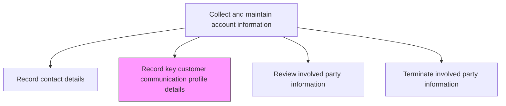
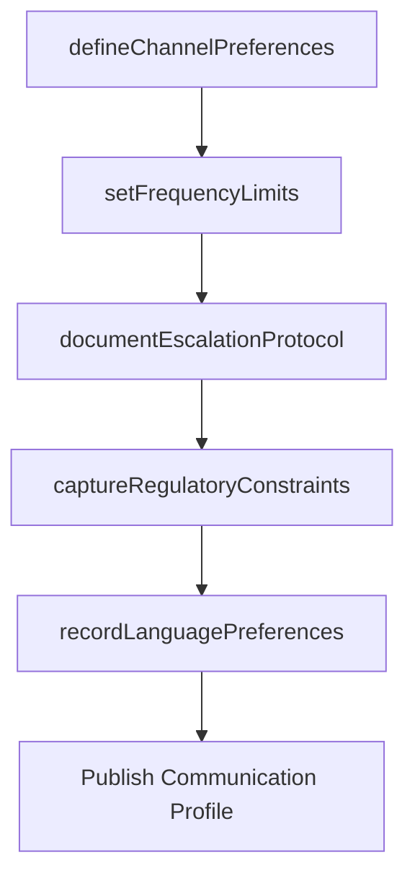

# Record key customer communication profile details

> Business-as-Code definition for customer communication profile recording. Models the documentation of customer communication preferences, business rules, and engagement protocols that govern how the organization interacts with each account.

## Overview

Providing information about important business rules regarding communicating with customers. Document preferred communication channels, frequency limits, escalation protocols, language preferences, and regulatory constraints that govern outreach to each customer account.

## Process Hierarchy



## GraphDL

```yaml
record:
  object: Key Customer Communication Profile Details
  actor: AccountManager
  result: CustomerCommunicationProfile
```

## Actions

| Action | Description |
|--------|-------------|
| defineChannelPreferences | Record the customer's preferred communication channels such as email, phone, or portal |
| setFrequencyLimits | Establish maximum outreach frequency and contact windows for each account |
| documentEscalationProtocol | Record the escalation path and contact hierarchy for issue resolution |
| captureRegulatoryConstraints | Document any legal or regulatory restrictions on customer communications |
| recordLanguagePreferences | Note the customer's preferred language for correspondence and support |

## Events

| Event | Description |
|-------|-------------|
| channelPreferencesDefined | Preferred communication channels recorded for the account |
| frequencyLimitsSet | Outreach frequency limits and contact windows established |
| escalationProtocolDocumented | Issue escalation path and contact hierarchy recorded |
| regulatoryConstraintsCaptured | Legal restrictions on communications documented |
| languagePreferencesRecorded | Preferred language for correspondence noted |

## Searches

| Search | Description |
|--------|-------------|
| getCommunicationProfile | Retrieve the full communication profile for a customer account |
| getChannelPreferences | Query preferred communication channels by customer |
| getContactRestrictions | Look up frequency limits and regulatory constraints by account |

## Process Flow



## RACI Matrix

| Activity | Responsible | Accountable | Consulted | Informed |
|----------|-------------|-------------|-----------|----------|
| defineChannelPreferences | AccountManager | SalesOperationsManager | Customer | Marketing |
| setFrequencyLimits | SalesOperationsAnalyst | SalesOperationsManager | Legal | Marketing |
| captureRegulatoryConstraints | LegalAnalyst | SalesOperationsManager | Compliance | Marketing |

## Related Processes

| Process | Relationship |
|---------|-------------|
| 3.5.4.2.5 Record contact details | Upstream - contact details inform communication profile setup |
| 3.5.2.4 Develop sales communication plan | Downstream - communication profiles constrain sales outreach planning |
| 3.2.6.8 Define communication guidelines and mechanisms | Upstream - organizational guidelines frame account-level profiles |

## Related Departments

| Department | Role |
|-----------|------|
| Sales | Records and maintains customer communication preferences |
| Marketing | Adheres to communication profiles for campaign targeting |
| Legal | Defines regulatory constraints on customer communications |

## Related Occupations

| Occupation | Involvement |
|-----------|-------------|
| Account Manager | Records customer communication preferences |
| Sales Operations Analyst | Configures and enforces communication rules in systems |
| Compliance Analyst | Documents regulatory constraints on outreach |

## KPIs

| KPI | Description | Unit |
|-----|-------------|------|
| Profile Completeness | Percentage of customer accounts with complete communication profiles | % |
| Preference Compliance Rate | Percentage of outreach that adheres to recorded communication preferences | % |
| Profile Currency | Average age of the most recent communication profile update | Months |

## Usage

```typescript
import { recordKeyCustomerCommunicationProfileDetails } from '@headlessly/record-key-customer-communication-profile-details'

const commProfile = recordKeyCustomerCommunicationProfileDetails()

// Define channel preferences for an account
const preferences = await commProfile.defineChannelPreferences({
  accountId: 'CUST-4820',
  preferredChannels: ['email', 'portal'],
  doNotContact: ['cold-call'],
  preferredContactTime: { timezone: 'America/New_York', hours: '09:00-17:00' }
})

// Set frequency limits for outreach
const limits = await commProfile.setFrequencyLimits({
  accountId: 'CUST-4820',
  maxEmailsPerMonth: 4,
  maxCallsPerMonth: 2,
  blackoutPeriods: ['december-holiday']
})
```
