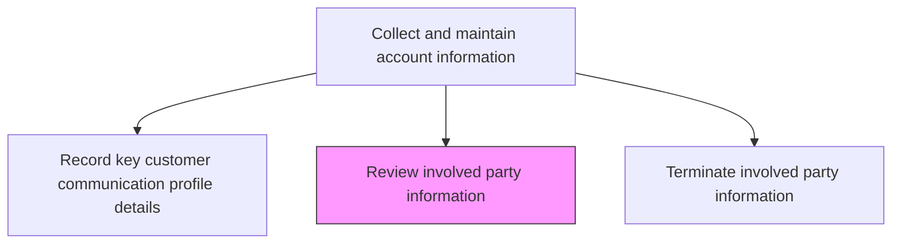
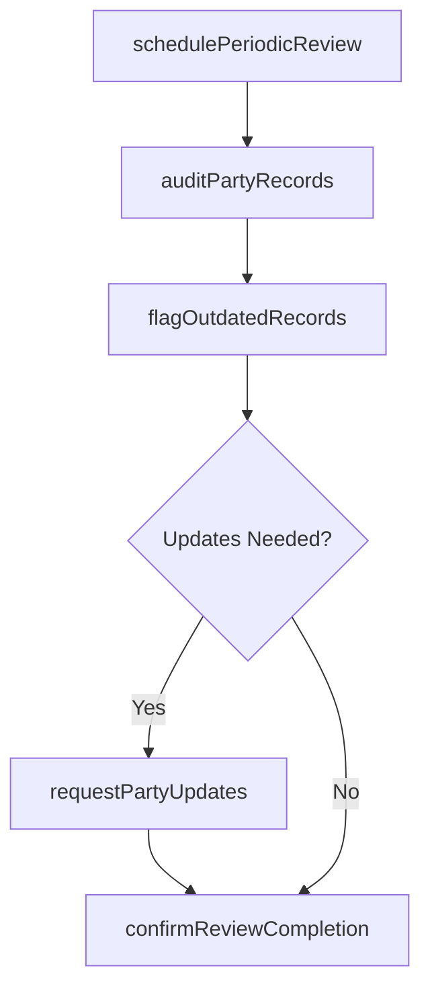

# Review involved party information

> Business-as-Code definition for involved party information review. Models the periodic audit and validation of all stakeholder records associated with customer accounts to ensure data accuracy, completeness, and currency.

## Overview

Revising information about involved parties. Periodically review all stakeholder records associated with customer accounts to identify outdated contacts, verify roles and responsibilities, confirm active status, and flag records requiring updates or removal.

## Process Hierarchy



## GraphDL

```yaml
review:
  object: Involved Party Information
  actor: SalesOperationsAnalyst
  result: PartyInformationReviewReport
```

## Actions

| Action | Description |
|--------|-------------|
| schedulePeriodicReview | Set review cadence for involved party data by account tier and data age |
| auditPartyRecords | Examine all party records for accuracy, completeness, and active status |
| flagOutdatedRecords | Identify party records with stale data, inactive contacts, or missing fields |
| requestPartyUpdates | Notify account owners to verify and refresh flagged party information |
| confirmReviewCompletion | Document that the review cycle is complete and records are current |

## Events

| Event | Description |
|-------|-------------|
| periodicReviewScheduled | Review cadence established for party data |
| partyRecordsAudited | All party records examined for accuracy and completeness |
| outdatedRecordsFlagged | Stale or incomplete party records identified |
| partyUpdatesRequested | Account owners notified to refresh flagged records |
| reviewCompleted | Review cycle documented as complete |

## Searches

| Search | Description |
|--------|-------------|
| getPartyReviewSchedule | Retrieve upcoming review dates by account or tier |
| getFlaggedPartyRecords | Query party records flagged as outdated or incomplete |
| getReviewHistory | Look up past review cycles and their outcomes |

## Process Flow



## RACI Matrix

| Activity | Responsible | Accountable | Consulted | Informed |
|----------|-------------|-------------|-----------|----------|
| auditPartyRecords | SalesOperationsAnalyst | SalesOperationsManager | CRM | Sales |
| flagOutdatedRecords | SalesOperationsAnalyst | SalesOperationsManager | AccountManagers | IT |
| requestPartyUpdates | SalesOperationsManager | VP Sales | AccountManagers | CRM |

## Related Processes

| Process | Relationship |
|---------|-------------|
| 3.5.4.2.3 Modify involved party details | Downstream - review findings trigger party modifications |
| 3.5.4.2.8 Terminate involved party information | Downstream - reviews identify parties that should be terminated |
| 3.5.2.7 Manage customer master data | Parallel - party reviews are part of broader data governance |

## Related Departments

| Department | Role |
|-----------|------|
| Sales Operations | Conducts periodic party data reviews |
| Sales | Validates and refreshes party information for assigned accounts |
| CRM | Maintains the systems that store party records |

## Related Occupations

| Occupation | Involvement |
|-----------|-------------|
| Sales Operations Analyst | Audits party records and flags data issues |
| Account Manager | Verifies and updates party information for assigned accounts |
| CRM Administrator | Supports review process with data quality tools |

## KPIs

| KPI | Description | Unit |
|-----|-------------|------|
| Review Completion Rate | Percentage of scheduled party reviews completed on time | % |
| Stale Record Rate | Percentage of party records flagged as outdated during review | % |
| Update Response Time | Average time for account owners to refresh flagged records | Days |

## Usage

```typescript
import { reviewInvolvedPartyInformation } from '@headlessly/review-involved-party-information'

const partyReview = reviewInvolvedPartyInformation()

// Audit party records for a set of accounts
const audit = await partyReview.auditPartyRecords({
  accountTier: 'enterprise',
  maxDataAge: 180,
  checkFields: ['email', 'phone', 'title', 'role', 'active-status']
})

// Flag outdated records for update
const flagged = await partyReview.flagOutdatedRecords({
  auditResults: audit.findings,
  notifyOwners: true,
  updateDeadline: '2026-03-01'
})
```
