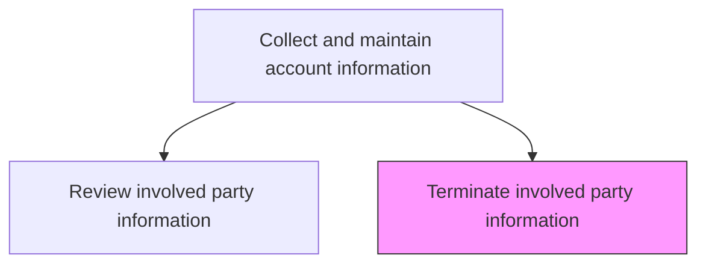
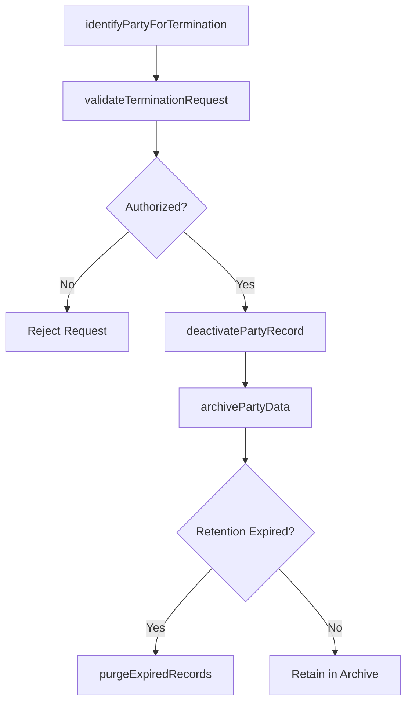

# Terminate involved party information

> Business-as-Code definition for involved party information termination. Models the deactivation, archival, and removal of stakeholder records when contacts leave, accounts close, or data retention policies require disposal.

## Overview

Dismissing information about involved parties. Deactivate, archive, or delete party records when contacts leave the customer organization, accounts are closed, or data retention policies mandate removal. Ensure proper compliance with privacy regulations during the termination process.

## Process Hierarchy



## GraphDL

```yaml
terminate:
  object: Involved Party Information
  actor: CRMAdministrator
  result: TerminatedPartyRecord
```

## Actions

| Action | Description |
|--------|-------------|
| identifyPartyForTermination | Locate party records that require deactivation due to departure, closure, or policy |
| validateTerminationRequest | Confirm authorization and verify no active dependencies on the party record |
| deactivatePartyRecord | Mark the party record as inactive and remove from active contact lists |
| archivePartyData | Move terminated party data to archive storage per retention policy |
| purgeExpiredRecords | Permanently delete party records that have exceeded their retention period |

## Events

| Event | Description |
|-------|-------------|
| partyForTerminationIdentified | Party records flagged for deactivation |
| terminationRequestValidated | Authorization confirmed and dependencies verified |
| partyRecordDeactivated | Party record marked inactive and removed from active lists |
| partyDataArchived | Terminated party data moved to archive storage |
| expiredRecordsPurged | Party records permanently deleted per retention policy |

## Searches

| Search | Description |
|--------|-------------|
| getTerminatedParties | Retrieve terminated party records by account or date |
| getArchiveRetentionStatus | Query archived party records and their remaining retention period |
| getPendingTerminations | Look up party termination requests awaiting processing |

## Process Flow



## RACI Matrix

| Activity | Responsible | Accountable | Consulted | Informed |
|----------|-------------|-------------|-----------|----------|
| validateTerminationRequest | CRMAdministrator | SalesOperationsManager | Legal | AccountManager |
| deactivatePartyRecord | CRMAdministrator | SalesOperationsManager | IT | Sales |
| purgeExpiredRecords | DataGovernanceOfficer | CRMAdministrator | Legal | Compliance |

## Related Processes

| Process | Relationship |
|---------|-------------|
| 3.5.4.2.7 Review involved party information | Upstream - reviews identify parties requiring termination |
| 3.5.4.2.3 Modify involved party details | Parallel - some modifications result in party replacement |
| 13.4.1 Manage data privacy and security | Parallel - termination must comply with data privacy regulations |

## Related Departments

| Department | Role |
|-----------|------|
| Sales Operations | Processes party termination requests |
| Legal | Ensures compliance with data retention and privacy regulations |
| IT | Manages data archival and purge processes |

## Related Occupations

| Occupation | Involvement |
|-----------|-------------|
| CRM Administrator | Deactivates and archives party records |
| Data Governance Officer | Ensures compliance with retention and privacy policies |
| Sales Operations Manager | Approves party termination requests |

## KPIs

| KPI | Description | Unit |
|-----|-------------|------|
| Termination Processing Time | Average time from request to party record deactivation | Hours |
| Retention Compliance Rate | Percentage of archived records within defined retention periods | % |
| Inactive Record Rate | Percentage of total party records in inactive status | % |

## Usage

```typescript
import { terminateInvolvedPartyInformation } from '@headlessly/terminate-involved-party-information'

const termination = terminateInvolvedPartyInformation()

// Deactivate a party record for a departed contact
const deactivated = await termination.deactivatePartyRecord({
  partyId: 'PARTY-2201',
  accountId: 'CUST-4820',
  reason: 'contact-departed',
  effectiveDate: '2026-02-01',
  removeFromMailingLists: true
})

// Archive party data per retention policy
const archived = await termination.archivePartyData({
  partyId: 'PARTY-2201',
  retentionPolicy: '7-years',
  archiveLocation: 'cold-storage'
})
```
