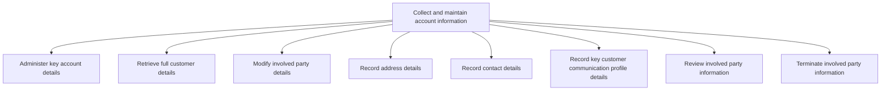
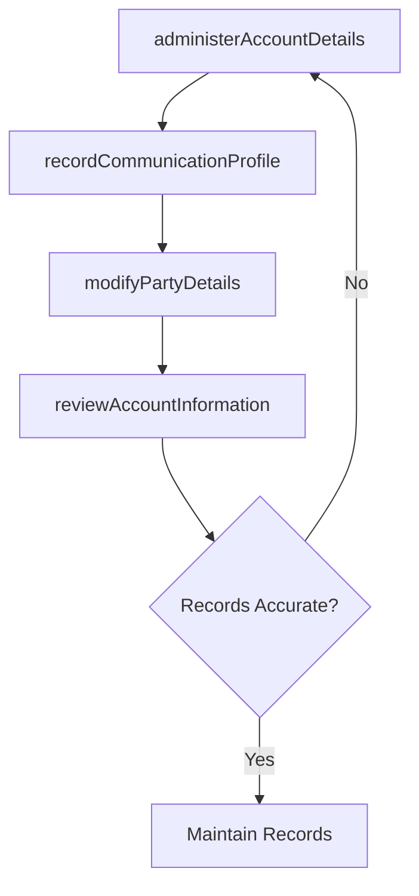

# Collect and maintain account information

> Business-as-Code definition for account information collection and maintenance. Models the administration, retrieval, modification, and governance of customer account details including contacts, addresses, communication profiles, and party relationships.

## Overview

Collecting and maintaining all account information. Collect information about the purchase, servicing, return, and/or commitment of any products/services on part of the organization to its customers. Bring together information from various organizational divisions, and update periodically.

## Process Hierarchy



## GraphDL

```yaml
collect:
  object: And Maintain Account Information
  actor: AccountAdministrator
  result: UpdatedAccountRecord
```

## Actions

| Action | Description |
|--------|-------------|
| administerAccountDetails | Manage and update key account information fields |
| retrieveCustomerDetails | Access comprehensive customer profile and transaction history |
| modifyPartyDetails | Update contact, address, and relationship details for involved parties |
| recordCommunicationProfile | Capture customer communication preferences and profile details |
| reviewAccountInformation | Periodically audit account records for accuracy and completeness |
| terminatePartyInformation | Archive or remove party records when relationships end |

## Events

| Event | Description |
|-------|-------------|
| accountDetailsAdministered | Key account information fields updated |
| customerDetailsRetrieved | Full customer profile accessed and validated |
| partyDetailsModified | Involved party information changes recorded |
| communicationProfileRecorded | Customer communication preferences captured |
| accountInformationReviewed | Account record audit completed |
| partyInformationTerminated | Party relationship record archived or removed |

## Searches

| Search | Description |
|--------|-------------|
| getAccountDetails | Retrieve account information by customer ID or account number |
| getContactDirectory | Access customer contacts by role, location, or department |
| getCommunicationProfiles | Query customer communication preferences and history |
| getAccountAuditLog | Retrieve change history for account records |

## Process Flow



## RACI Matrix

| Activity | Responsible | Accountable | Consulted | Informed |
|----------|-------------|-------------|-----------|----------|
| administerAccountDetails | AccountAdministrator | SalesOperationsManager | AccountManager | Finance |
| retrieveCustomerDetails | AccountAdministrator | SalesOperationsManager | Sales | CustomerSuccess |
| modifyPartyDetails | AccountAdministrator | SalesOperationsManager | Legal | Sales |
| reviewAccountInformation | DataQualityAnalyst | SalesOperationsManager | IT | Sales |

## Sub-Processes

| ID | Name | Description |
|----|------|-------------|
| 3.5.4.2.1 | Administer key account details | Managing essential information of customer accounts. |
| 3.5.4.2.2 | Retrieve full customer details | Obtaining detailed information about customers. |
| 3.5.4.2.3 | Modify involved party details | Altering information about involved parties. |
| 3.5.4.2.4 | Record address details | Documenting address information. |
| 3.5.4.2.5 | Record contact details | Documenting contact information. |
| 3.5.4.2.6 | Record key customer communication profile details | Providing information about important business rules regarding communicating with customers. |
| 3.5.4.2.7 | Review involved party information | Revising information about involved parties. |
| 3.5.4.2.8 | Terminate involved party information | Dismissing information about involved parties. |

## Related Processes

| Process | Relationship |
|---------|-------------|
| 3.5.2.7 Manage customer master data | Parallel - account information feeds master data management |
| 3.5.4.1 Accept and validate sales orders | Upstream - order processing requires account information |
| 3.5.2.6 Manage customer relationships | Parallel - relationship management depends on accurate account data |
| 3.5.4.5 Enter orders into system | Downstream - account data required for order entry |

## Related Departments

| Department | Role |
|-----------|------|
| Sales Operations | Manages account record administration and quality |
| Sales | Provides account context and relationship information |
| IT | Maintains account data systems and integration |
| Finance | Manages billing and payment account details |
| Legal | Ensures data handling meets compliance requirements |

## Related Occupations

| Occupation | Involvement |
|-----------|-------------|
| Account Administrator | Manages day-to-day account record maintenance |
| CRM Administrator | Configures and manages account data in CRM systems |
| Data Quality Analyst | Audits account records for accuracy and completeness |
| Sales Operations Analyst | Uses account data for reporting and analytics |

## KPIs

| KPI | Description | Unit |
|-----|-------------|------|
| Account Completeness Rate | Percentage of accounts with all required fields populated | % |
| Contact Data Accuracy | Percentage of contact records verified as current | % |
| Account Update Frequency | Average days between account record updates | Days |
| Data Entry Error Rate | Percentage of account records with entry errors | % |

## Usage

```typescript
import { collectAndMaintainAccountInformation } from '@headlessly/collect-and-maintain-account-information'

const accountInfo = collectAndMaintainAccountInformation()

// Administer key account details
const updated = await accountInfo.administerAccountDetails({
  accountId: 'acct-12345',
  fields: {
    industry: 'technology',
    annualRevenue: 50000000,
    employeeCount: 500
  }
})

// Review account information for audit
const review = await accountInfo.reviewAccountInformation({
  scope: 'key-accounts',
  checkFields: ['contacts', 'addresses', 'communicationPreferences'],
  flagStaleRecords: true
})
```
