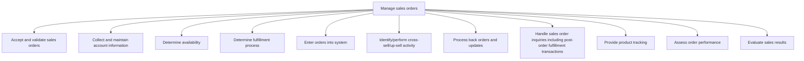
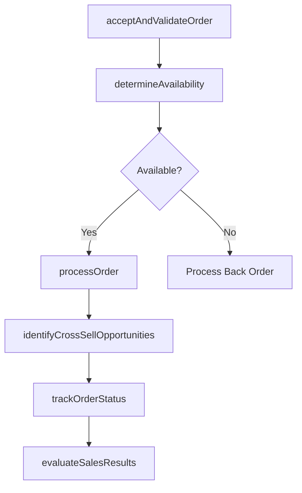

# Manage sales orders

> Business-as-Code definition for sales order management. Models the end-to-end order lifecycle from acceptance and validation through fulfillment determination, cross-sell identification, backorder processing, tracking, and performance evaluation.

## Overview

Taking, receiving, processing, and acknowledging new customer orders or amendments to outstanding customer orders. Monitoring status from order receipt to customer delivery/customer invoicing.

## Process Hierarchy



## GraphDL

```yaml
manage:
  object: Sales Orders
  actor: OrderManagementSpecialist
  result: ProcessedSalesOrder
```

## Actions

| Action | Description |
|--------|-------------|
| acceptAndValidateOrder | Receive, verify, and confirm incoming sales orders |
| determineAvailability | Check product or service availability for order fulfillment |
| processOrder | Enter validated orders into the system and initiate fulfillment |
| identifyCrossSellOpportunities | Detect upsell and cross-sell opportunities during order processing |
| trackOrderStatus | Monitor order progress from entry through delivery |
| evaluateSalesResults | Assess order performance metrics and sales outcomes |

## Events

| Event | Description |
|-------|-------------|
| orderAcceptedAndValidated | Sales order received and validated for processing |
| availabilityDetermined | Product or service availability confirmed |
| orderProcessed | Order entered into system and fulfillment initiated |
| crossSellIdentified | Upsell or cross-sell opportunity flagged during order processing |
| orderStatusTracked | Order tracking update provided to customer |
| salesResultsEvaluated | Order performance and sales results analyzed |

## Searches

| Search | Description |
|--------|-------------|
| getSalesOrders | Retrieve sales orders by status, customer, or date range |
| getOrderStatus | Track real-time order fulfillment status |
| getBackOrders | Access unfulfilled orders pending availability |
| getOrderPerformance | Query order accuracy, cycle time, and volume metrics |
| getCrossSellResults | Retrieve cross-sell and upsell conversion data |

## Process Flow



## RACI Matrix

| Activity | Responsible | Accountable | Consulted | Informed |
|----------|-------------|-------------|-----------|----------|
| acceptAndValidateOrder | OrderManagementSpecialist | SalesOperationsManager | Sales | Finance |
| determineAvailability | InventoryPlanner | SalesOperationsManager | SupplyChain | Sales |
| processOrder | OrderManagementSpecialist | SalesOperationsManager | Finance | Fulfillment |
| identifyCrossSellOpportunities | AccountExecutive | SalesManager | ProductManagement | Marketing |
| evaluateSalesResults | SalesAnalyst | VP Sales | Finance | ExecutiveTeam |

## Sub-Processes

| ID | Name | Description |
|----|------|-------------|
| 3.5.4.1 | Accept and validate sales orders | Receiving and confirming orders from customers. Verify that no extra expenses have to be disbursed o |
| 3.5.4.2 | Collect and maintain account information | Collecting and maintaining all account information. Collect information about the purchase, servicin |
| 3.5.4.3 | Determine availability | Ascertaining the volume or scale of products/services to provide to customers to fulfill sales order |
| 3.5.4.4 | Determine fulfillment process | Devising a blueprint for order fulfillment. Create a schematic flow encompassing all activities to d |
| 3.5.4.5 | Enter orders into system | Analyzing all data relating to sales orders by entering it into a centralized repository, and using  |
| 3.5.4.6 | Identify/perform cross-sell/up-sell activity | Utilizing customer inquiries as opportunities to either provide a comparable service to the one in q |
| 3.5.4.7 | Process back orders and updates | Processing any unfulfilled orders, and updating the status of any orders that have been accepted and |
| 3.5.4.8 | Handle sales order inquiries including post-order fulfillment transactions | Attending to any queries received from the customers, even after a sales order has been serviced. De |
| 3.5.4.9 | Provide product tracking | Capturing shipment events, consolidating tracking data across carriers, and delivering proactive delivery status updates and alerts to customers and internal teams. |
| 3.5.4.10 | Assess order performance | Measuring order cycle times, fulfillment accuracy, error rates, and throughput to identify operational bottlenecks and drive order management process improvements. |
| 3.5.4.11 | Evaluate sales results | Analyzing sales results against quotas and forecasts, conducting win/loss analysis, and assessing sales rep performance to inform strategy adjustments. |

## Related Processes

| Process | Relationship |
|---------|-------------|
| 3.5.3 Develop and manage sales proposals, bids, and quotes | Upstream - accepted proposals become sales orders |
| 4.0 Deliver Products and Services | Downstream - orders flow to fulfillment |
| 3.5.2 Manage customers and accounts | Parallel - order data updates account records |
| 3.5.1 Manage leads/opportunities | Upstream - closed opportunities generate orders |

## Related Departments

| Department | Role |
|-----------|------|
| Sales Operations | Processes and manages order lifecycle |
| Fulfillment | Executes product delivery and service provisioning |
| Finance | Manages invoicing and revenue recognition |
| Customer Service | Handles order inquiries and post-sale transactions |
| Inventory Management | Ensures product availability for order fulfillment |

## Related Occupations

| Occupation | Involvement |
|-----------|-------------|
| Order Management Specialist | Processes and tracks sales orders |
| Sales Operations Manager | Oversees order management processes and performance |
| Fulfillment Coordinator | Coordinates order delivery and logistics |
| Sales Analyst | Evaluates order performance and sales results |

## KPIs

| KPI | Description | Unit |
|-----|-------------|------|
| Order Accuracy Rate | Percentage of orders processed without errors | % |
| Order Cycle Time | Average time from order receipt to fulfillment | Days |
| Backorder Rate | Percentage of orders requiring backorder processing | % |
| Cross-Sell Attach Rate | Percentage of orders including cross-sell or upsell items | % |
| Order Fill Rate | Percentage of order lines fulfilled on first attempt | % |

## Usage

```typescript
import { manageSalesOrders } from '@headlessly/manage-sales-orders'

const orders = manageSalesOrders()

// Accept and validate a new sales order
const order = await orders.acceptAndValidateOrder({
  customerId: 'enterprise-client-001',
  items: [
    { productId: 'platform-enterprise', quantity: 1, term: { months: 12 } },
    { productId: 'analytics-addon', quantity: 1, term: { months: 12 } }
  ]
})

// Track order status
const status = await orders.trackOrderStatus({
  orderId: order.id,
  includeTimeline: true
})
```
