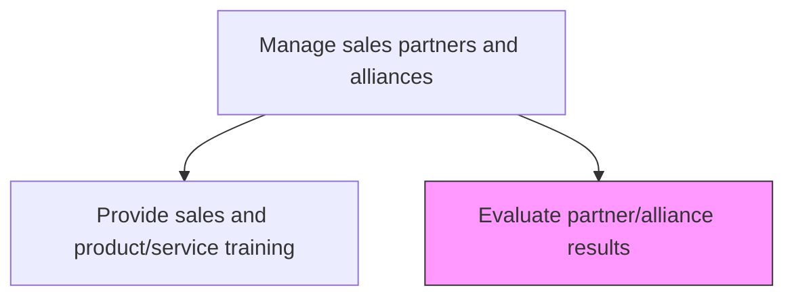
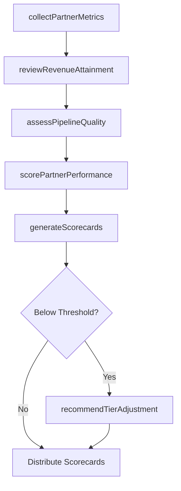

# Evaluate partner/alliance results

> Business-as-Code definition for evaluating sales partner and alliance performance. Models the process of measuring partner contribution to revenue, assessing pipeline quality, reviewing conversion metrics, and determining partner tier standing.

## Overview

Examining the performance of its partners/alliances in selling its products/services. Use metrics such as growth in revenue generated, conversion rate, and total outreach to customers for assessing the performance results.

## Process Hierarchy



## GraphDL

```yaml
evaluate:
  object: Partner/alliance Results
  actor: PartnerManager
  result: PartnerPerformanceReport
```

## Actions

| Action | Description |
|--------|-------------|
| collectPartnerMetrics | Gather revenue, pipeline, and activity data from partner reporting systems |
| scorePartnerPerformance | Calculate composite performance score against tier benchmarks |
| assessPipelineQuality | Evaluate the health and conversion potential of partner-sourced pipeline |
| reviewRevenueAttainment | Compare actual partner revenue against quota and forecast |
| generateScorecards | Produce quarterly partner performance scorecards with trend analysis |
| recommendTierAdjustment | Propose partner tier upgrades or downgrades based on performance |

## Events

| Event | Description |
|-------|-------------|
| partnerMetricsCollected | Performance data gathered from partner systems |
| partnerScored | Composite performance score calculated for a partner |
| pipelineQualityAssessed | Partner pipeline health evaluation completed |
| revenueAttainmentReviewed | Partner revenue vs. quota comparison completed |
| scorecardGenerated | Quarterly partner scorecard produced |
| tierAdjustmentRecommended | Partner tier change proposed based on evaluation |

## Searches

| Search | Description |
|--------|-------------|
| findPartnersByPerformance | List partners ranked by composite score or specific metric |
| getPartnerScorecard | Retrieve detailed performance scorecard for a specific partner |
| getPipelineByPartner | Get partner-sourced deal pipeline with stage breakdown |
| getRevenueAttainment | Retrieve partner revenue vs. quota data over time |

## Process Flow



## RACI Matrix

| Activity | Responsible | Accountable | Consulted | Informed |
|----------|-------------|-------------|-----------|----------|
| collectPartnerMetrics | PartnerOpsAnalyst | VP Partnerships | SalesOps | PartnerManagers |
| scorePartnerPerformance | PartnerManager | VP Partnerships | Finance | ChannelMarketing |
| assessPipelineQuality | PartnerManager | VP Partnerships | SalesLeadership | RevOps |
| recommendTierAdjustment | VP Partnerships | CRO | LegalTeam | PartnerManagers |

## Related Processes

| Process | Relationship |
|---------|-------------|
| 3.5.5 Manage sales partners and alliances | Parent process |
| 3.5.5.1 Provide sales and product/service training | Sibling - training gaps identified through evaluation |
| 3.5.1 Develop sales forecast | Downstream - partner performance informs forecasting |
| 3.5.3 Manage sales opportunities | Parallel - partner-sourced opportunities tracked here |

## Related Departments

| Department | Role |
|-----------|------|
| Partner Management | Primary owner of partner evaluation process |
| Sales Operations | Provides data infrastructure and reporting |
| Finance | Validates revenue attribution and commission calculations |
| Channel Marketing | Evaluates co-marketing effectiveness |

## Related Occupations

| Occupation | Involvement |
|-----------|-------------|
| Partner Account Manager | Day-to-day partner relationship and evaluation |
| Channel Operations Analyst | Data collection and scorecard preparation |
| VP of Partnerships | Final authority on tier decisions |

## KPIs

| KPI | Description | Unit |
|-----|-------------|------|
| Partner Revenue Attainment | Percentage of partner revenue quota achieved | % |
| Partner Pipeline Conversion | Rate at which partner-sourced pipeline converts to closed-won | % |
| Partner Satisfaction Score | Survey-based satisfaction rating from partners | Score (1-10) |
| Deal Registration Accuracy | Percentage of registered deals that close as expected | % |

## Usage

```typescript
import { evaluatePartnerAllianceResults } from '@headlessly/evaluate-partner-alliance-results'

const partnerEval = evaluatePartnerAllianceResults()

// Score a specific partner's quarterly performance
const score = await partnerEval.scorePartnerPerformance({
  partnerId: 'partner-2048',
  period: 'Q3-2024',
  metrics: ['revenue', 'pipeline', 'dealRegistration']
})

// Generate scorecards for all Gold-tier partners
const scorecards = await partnerEval.generateScorecards({
  tier: 'Gold',
  period: 'Q3-2024'
})

// Find underperforming partners for tier review
const atRisk = await partnerEval.findPartnersByPerformance({
  scoreBelow: 60,
  tier: 'Gold'
})
```
