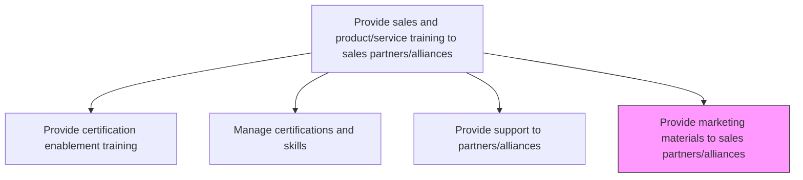
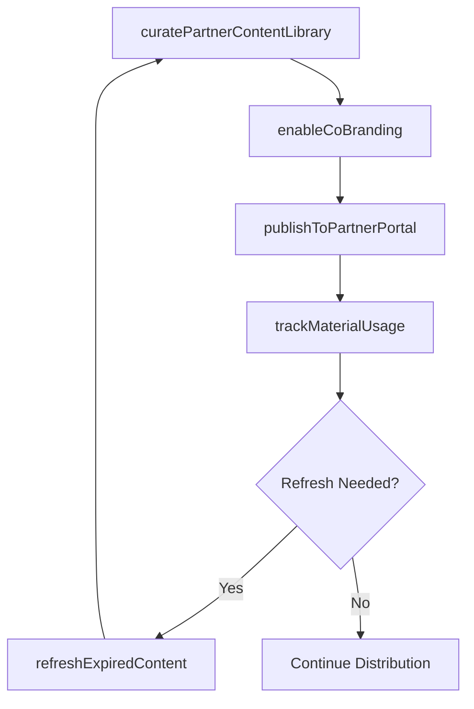

# Provide marketing materials to sales partners/alliances

> Business-as-Code definition for partner marketing material distribution. Models the curation, distribution, and management of sales collateral, brochures, and co-branded marketing assets for channel partners and alliance organizations.

## Overview

Distributing marketing materials and sales brochures to entities that the company partners with. Curate and distribute product datasheets, sales presentations, competitive battlecards, co-branded collateral, and digital marketing assets through partner portals and direct channels.

## Process Hierarchy



## GraphDL

```yaml
provide:
  object: Marketing Materials To Sales Partners/alliances
  actor: ChannelMarketingManager
  result: DistributedPartnerMaterials
```

## Actions

| Action | Description |
|--------|-------------|
| curatePartnerContentLibrary | Select and organize marketing materials appropriate for partner use and co-branding |
| publishToPartnerPortal | Upload approved materials to the partner-accessible content management portal |
| enableCoBranding | Provide customizable templates that partners can co-brand with their own identity |
| trackMaterialUsage | Monitor which materials partners download, share, and use in customer-facing activities |
| refreshExpiredContent | Update or retire materials that are outdated, off-brand, or no longer compliant |

## Events

| Event | Description |
|-------|-------------|
| partnerContentLibraryCurated | Marketing materials selected and organized for partner distribution |
| materialsPublishedToPortal | Approved materials uploaded to the partner portal |
| coBrandingEnabled | Customizable co-branding templates made available to partners |
| materialUsageTracked | Partner material downloads and usage monitored |
| expiredContentRefreshed | Outdated materials updated or retired |

## Searches

| Search | Description |
|--------|-------------|
| getPartnerMaterials | Retrieve available marketing materials by product, type, or partner tier |
| getMaterialUsageReport | Query material download and usage metrics by partner |
| getExpiredMaterials | Look up materials due for refresh or retirement |

## Process Flow



## RACI Matrix

| Activity | Responsible | Accountable | Consulted | Informed |
|----------|-------------|-------------|-----------|----------|
| curatePartnerContentLibrary | ChannelMarketingManager | VP Marketing | ProductMarketing | ChannelPartners |
| publishToPartnerPortal | ContentOperations | ChannelMarketingManager | IT | PartnerManagers |
| trackMaterialUsage | ChannelMarketingAnalyst | ChannelMarketingManager | PartnerManagers | VP Sales |

## Related Processes

| Process | Relationship |
|---------|-------------|
| 3.5.5.1.1 Provide certification enablement training | Parallel - training materials complement marketing collateral |
| 3.3.10 Manage product marketing content | Upstream - product marketing content is the source for partner materials |
| 3.5.5.1.3 Provide support to partners/alliances | Parallel - marketing materials support partner selling activities |

## Related Departments

| Department | Role |
|-----------|------|
| Channel Marketing | Curates and distributes partner marketing materials |
| Product Marketing | Creates source content for partner collateral |
| Content Operations | Manages the partner portal and content distribution |

## Related Occupations

| Occupation | Involvement |
|-----------|-------------|
| Channel Marketing Manager | Leads partner material curation and distribution |
| Content Operations Specialist | Manages partner portal content and co-branding templates |
| Partner Manager | Supports partners in finding and using available materials |

## KPIs

| KPI | Description | Unit |
|-----|-------------|------|
| Material Adoption Rate | Percentage of active partners that download materials each quarter | % |
| Content Currency | Percentage of partner materials that are current and not expired | % |
| Co-Brand Utilization | Percentage of partners using co-branding templates | % |

## Usage

```typescript
import { provideMarketingMaterialsToSalesPartnersAlliances } from '@headlessly/provide-marketing-materials-to-sales-partners-alliances'

const partnerContent = provideMarketingMaterialsToSalesPartnersAlliances()

// Publish materials to the partner portal
const published = await partnerContent.publishToPartnerPortal({
  materials: ['product-datasheet-v3', 'competitive-battlecard-q1', 'case-study-enterprise'],
  partnerTiers: ['gold', 'platinum'],
  coBrandingEnabled: true,
  effectiveDate: '2026-02-15'
})

// Track material usage across partners
const usage = await partnerContent.trackMaterialUsage({
  period: 'last-quarter',
  groupBy: 'partner',
  metrics: ['downloads', 'shares', 'customer-presentations']
})
```
