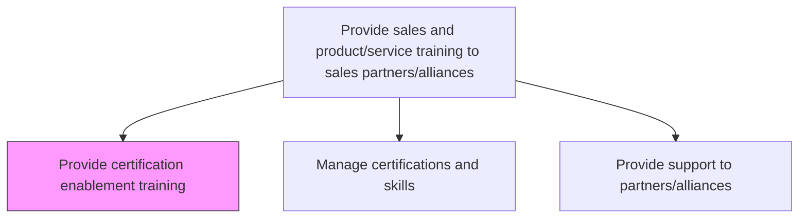
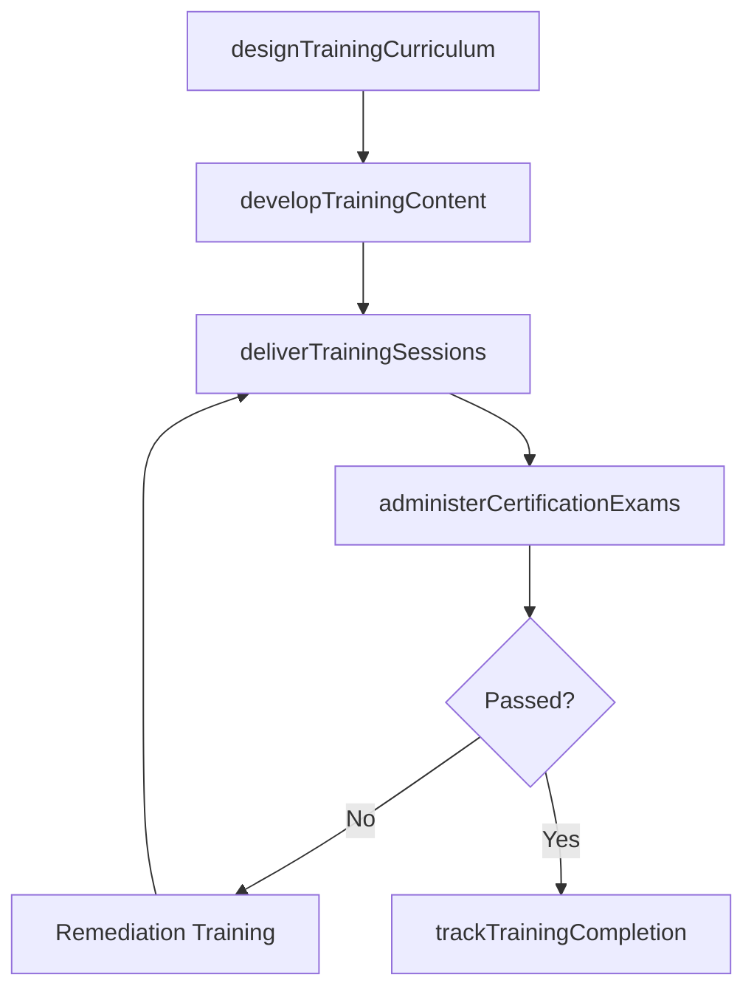

# Provide certification enablement training

> Business-as-Code definition for partner certification and enablement training. Models the design, delivery, and management of training programs that certify sales partners on products, solutions, and selling methodologies.

## Overview

Provide training and certification to develop strategies for marketing-driven sales. Design and deliver product knowledge, solution selling, and technical certification programs for channel partners and alliance sales teams. Ensure partners are equipped to effectively position, demonstrate, and sell the organization's offerings.

## Process Hierarchy



## GraphDL

```yaml
provide:
  object: Certification Enablement Training
  actor: PartnerEnablementManager
  result: PartnerCertification
```

## Actions

| Action | Description |
|--------|-------------|
| designTrainingCurriculum | Create structured learning paths covering product knowledge, solution selling, and technical skills |
| developTrainingContent | Build training modules, videos, assessments, and hands-on labs for partner enablement |
| deliverTrainingSessions | Conduct live, virtual, or self-paced training sessions for partner sales teams |
| administerCertificationExams | Manage certification assessments and issue credentials to qualified partners |
| trackTrainingCompletion | Monitor partner participation, progress, and certification attainment rates |

## Events

| Event | Description |
|-------|-------------|
| trainingCurriculumDesigned | Learning paths created for partner certification programs |
| trainingContentDeveloped | Training modules and assessments built and published |
| trainingSessionsDelivered | Training sessions conducted for partner sales teams |
| certificationExamsAdministered | Certification assessments managed and credentials issued |
| trainingCompletionTracked | Partner training progress and certification rates monitored |

## Searches

| Search | Description |
|--------|-------------|
| getTrainingPrograms | Retrieve available training programs by product or certification level |
| getCertificationStatus | Query certification status by partner or individual |
| getTrainingCompletion | Look up training completion rates by partner organization |

## Process Flow



## RACI Matrix

| Activity | Responsible | Accountable | Consulted | Informed |
|----------|-------------|-------------|-----------|----------|
| designTrainingCurriculum | PartnerEnablementManager | VP ChannelSales | ProductManagement | Marketing |
| deliverTrainingSessions | PartnerTrainer | PartnerEnablementManager | SalesEngineering | Partners |
| administerCertificationExams | PartnerEnablementManager | VP ChannelSales | QualityAssurance | PartnerManagers |

## Related Processes

| Process | Relationship |
|---------|-------------|
| 3.5.5.1.2 Manage certifications and skills | Downstream - training leads to certification management |
| 3.5.5.1.4 Provide marketing materials to sales partners/alliances | Parallel - training and materials together enable partner selling |
| 3.5.5.1.3 Provide support to partners/alliances | Parallel - training reduces partner support burden |

## Related Departments

| Department | Role |
|-----------|------|
| Partner Enablement | Designs and delivers partner training programs |
| Product Management | Provides product expertise for training content |
| Sales Engineering | Contributes technical training modules |

## Related Occupations

| Occupation | Involvement |
|-----------|-------------|
| Partner Enablement Manager | Leads training program design and certification management |
| Partner Trainer | Delivers training sessions to partner sales teams |
| Sales Engineer | Provides technical training content and demos |

## KPIs

| KPI | Description | Unit |
|-----|-------------|------|
| Certification Rate | Percentage of eligible partner reps that achieve certification | % |
| Training Completion Rate | Percentage of partners that complete assigned training programs | % |
| Time to Certification | Average time from enrollment to certification achievement | Days |
| Certified Partner Revenue Lift | Revenue increase from certified versus non-certified partners | % |

## Usage

```typescript
import { provideCertificationEnablementTraining } from '@headlessly/provide-certification-enablement-training'

const enablement = provideCertificationEnablementTraining()

// Deliver a training session for partner sales teams
const session = await enablement.deliverTrainingSessions({
  programId: 'platform-sales-certification-v3',
  format: 'virtual-instructor-led',
  partners: ['partner-alpha', 'partner-beta'],
  sessionDate: '2026-03-10',
  duration: '4-hours'
})

// Administer certification exam after training
const exam = await enablement.administerCertificationExams({
  programId: 'platform-sales-certification-v3',
  participants: session.attendees,
  examFormat: 'online-proctored',
  passingScore: 80
})
```
