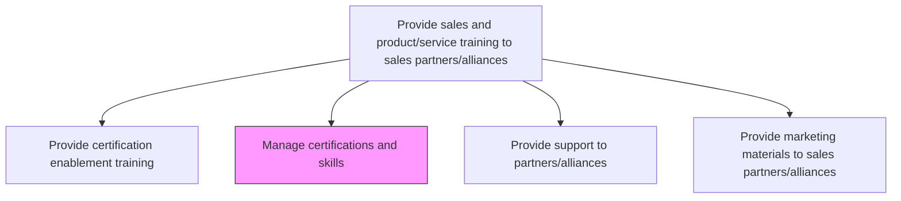
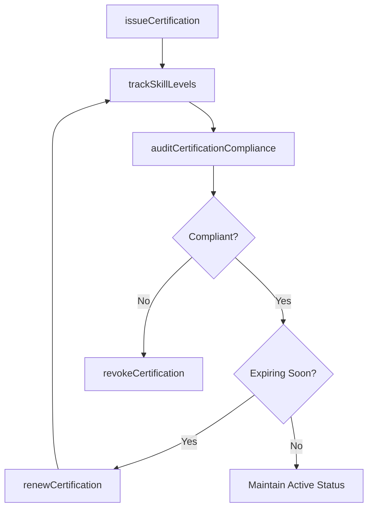

# Manage certifications and skills

> Business-as-Code definition for partner certification and skills management. Models the review, issuance, renewal, and revocation of certifications and the tracking of accredited competencies across channel partners and alliance organizations.

## Overview

Reviewing, processing and issuing certifications and accrediting skills and competencies. Maintain a centralized registry of partner certifications, track expiration dates, manage renewal workflows, and ensure that partner skill levels align with the organization's tiered requirements for selling and supporting products and services.

## Process Hierarchy



## GraphDL

```yaml
manage:
  object: Certifications And Skills
  actor: CertificationProgramManager
  result: CertificationRecord
```

## Actions

| Action | Description |
|--------|-------------|
| issueCertification | Grant certification credentials to partners who pass required assessments |
| renewCertification | Process certification renewals before expiration based on continuing education |
| revokeCertification | Remove certification status when partners fail to meet ongoing requirements |
| trackSkillLevels | Monitor and record partner competency levels across product and solution areas |
| manageCertificationTiers | Define and maintain bronze, silver, gold, and platinum certification tier requirements |
| auditCertificationCompliance | Verify that certified partners continue to meet program requirements |

## Events

| Event | Description |
|-------|-------------|
| certificationIssued | New certification credential granted to a partner individual |
| certificationRenewed | Existing certification successfully renewed for another term |
| certificationRevoked | Certification removed due to non-compliance or failed renewal |
| skillLevelsTracked | Partner competency levels updated in the skills registry |
| certificationTiersManaged | Tier requirements created or updated |
| certificationComplianceAudited | Partner certification compliance audit completed |

## Searches

| Search | Description |
|--------|-------------|
| getCertifiedPartners | Retrieve partners by certification type, tier, or status |
| getCertificationExpiry | Query certifications approaching expiration within a date range |
| getSkillGapReport | Look up skill gaps across the partner ecosystem by product area |
| getCertificationHistory | Retrieve certification issuance and renewal history for a partner |

## Process Flow



## RACI Matrix

| Activity | Responsible | Accountable | Consulted | Informed |
|----------|-------------|-------------|-----------|----------|
| issueCertification | CertificationProgramManager | VP ChannelSales | PartnerEnablementManager | Partners |
| renewCertification | CertificationProgramManager | VP ChannelSales | PartnerTrainer | PartnerManagers |
| revokeCertification | CertificationProgramManager | VP ChannelSales | Legal | Partners |
| auditCertificationCompliance | CertificationProgramManager | VP ChannelSales | QualityAssurance | PartnerManagers |

## Related Processes

| Process | Relationship |
|---------|-------------|
| 3.5.5.1.1 Provide certification enablement training | Upstream - training completion triggers certification issuance |
| 3.5.5.1.3 Provide support to partners/alliances | Parallel - certified partners receive differentiated support |
| 3.5.5.1.4 Provide marketing materials to sales partners/alliances | Parallel - certification tier determines material access |

## Related Departments

| Department | Role |
|-----------|------|
| Partner Enablement | Administers certification programs and skills registry |
| Channel Sales | Sets certification tier requirements aligned with partner strategy |
| Quality Assurance | Validates certification assessment integrity |

## Related Occupations

| Occupation | Involvement |
|-----------|-------------|
| Certification Program Manager | Administers issuance, renewal, and revocation of certifications |
| Partner Enablement Manager | Aligns certification requirements with training programs |
| Partner Manager | Supports partners through certification and renewal processes |

## KPIs

| KPI | Description | Unit |
|-----|-------------|------|
| Active Certification Rate | Percentage of eligible partner reps holding active certifications | % |
| Certification Renewal Rate | Percentage of expiring certifications successfully renewed on time | % |
| Average Time to Certify | Mean elapsed time from enrollment to certification issuance | Days |
| Skill Coverage Index | Percentage of product areas covered by at least one certified partner per region | % |

## Usage

```typescript
import { manageCertificationsAndSkills } from '@headlessly/manage-certifications-and-skills'

const certifications = manageCertificationsAndSkills()

// Issue a certification after successful assessment
const cert = await certifications.issueCertification({
  partnerId: 'partner-alpha',
  individualId: 'rep-1042',
  certType: 'platform-sales-certified',
  tier: 'gold',
  validUntil: '2027-02-01',
  assessmentScore: 92
})

// Query certifications expiring in the next 60 days
const expiring = await certifications.getCertificationExpiry({
  withinDays: 60,
  certType: 'platform-sales-certified',
  notifyPartners: true
})
```
