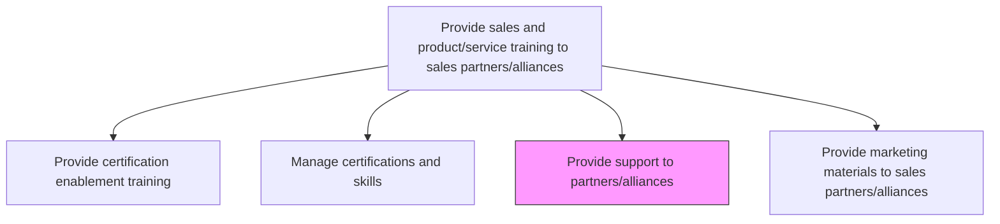
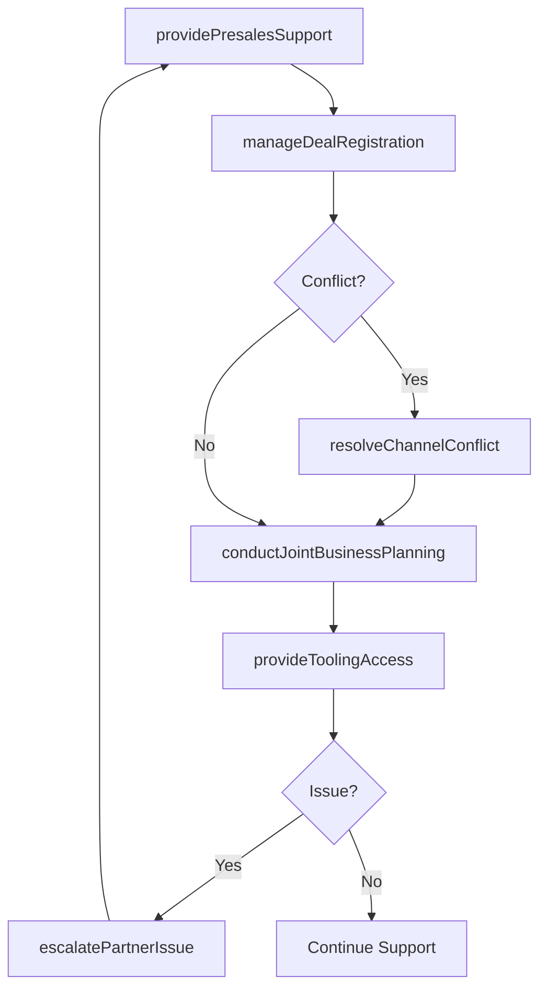

# Provide support to partners/alliances

> Business-as-Code definition for partner and alliance support operations. Models the delivery of pre-sales technical assistance, deal registration support, escalation management, and ongoing operational guidance to channel partners and strategic alliance organizations.

## Overview

Backing sales partners and strategic alliances. Provide dedicated pre-sales engineering support, deal registration and conflict resolution, technical escalation paths, joint business planning assistance, and operational tooling access to help partners successfully sell, implement, and support the organization's products and services.

## Process Hierarchy



## GraphDL

```yaml
provide:
  object: Support To Partners/alliances
  actor: PartnerSupportManager
  result: PartnerSupportOutcome
```

## Actions

| Action | Description |
|--------|-------------|
| providePresalesSupport | Deliver technical pre-sales assistance for partner-led opportunities |
| manageDealRegistration | Process partner deal registrations and resolve channel conflicts |
| escalatePartnerIssue | Route unresolved partner issues to appropriate internal teams for resolution |
| conductJointBusinessPlanning | Facilitate collaborative business planning sessions with strategic partners |
| provideToolingAccess | Grant partners access to demo environments, sandbox instances, and sales tools |
| resolveChannelConflict | Mediate disputes between overlapping partner territories or competing deals |

## Events

| Event | Description |
|-------|-------------|
| presalesSupportProvided | Pre-sales technical assistance delivered for a partner opportunity |
| dealRegistrationManaged | Partner deal registration processed and approved or rejected |
| partnerIssueEscalated | Unresolved partner issue routed to internal resolution team |
| jointBusinessPlanCompleted | Collaborative business plan finalized with partner |
| toolingAccessProvided | Partner granted access to demo and sales tooling |
| channelConflictResolved | Territory or deal conflict between partners mediated and resolved |

## Searches

| Search | Description |
|--------|-------------|
| getPartnerSupportTickets | Retrieve open support requests by partner, priority, or category |
| getDealRegistrations | Query deal registrations by partner, status, or date range |
| getEscalationHistory | Look up escalation records and resolution outcomes for a partner |
| getPartnerToolingStatus | Check partner access status for demo environments and sales tools |

## Process Flow



## RACI Matrix

| Activity | Responsible | Accountable | Consulted | Informed |
|----------|-------------|-------------|-----------|----------|
| providePresalesSupport | PartnerSalesEngineer | PartnerSupportManager | SalesEngineering | PartnerManager |
| manageDealRegistration | PartnerOperationsAnalyst | VP ChannelSales | Sales | Partners |
| resolveChannelConflict | PartnerSupportManager | VP ChannelSales | Legal | Partners |
| conductJointBusinessPlanning | PartnerManager | VP ChannelSales | ProductManagement | Marketing |

## Related Processes

| Process | Relationship |
|---------|-------------|
| 3.5.5.1.1 Provide certification enablement training | Upstream - trained partners require less support |
| 3.5.5.1.2 Manage certifications and skills | Parallel - certification tier determines support level |
| 3.5.5.1.4 Provide marketing materials to sales partners/alliances | Parallel - materials complement hands-on support |
| 3.5.4.8 Handle sales order inquiries | Downstream - partner support requests may involve order inquiries |

## Related Departments

| Department | Role |
|-----------|------|
| Partner Operations | Manages day-to-day partner support processes |
| Sales Engineering | Provides technical pre-sales support for partner deals |
| Channel Sales | Oversees partner relationships and conflict resolution |

## Related Occupations

| Occupation | Involvement |
|-----------|-------------|
| Partner Support Manager | Leads partner support operations and escalation management |
| Partner Sales Engineer | Delivers technical pre-sales assistance for partner opportunities |
| Partner Operations Analyst | Processes deal registrations and manages partner tooling access |

## KPIs

| KPI | Description | Unit |
|-----|-------------|------|
| Partner Support Resolution Time | Average time to resolve partner support requests | Hours |
| Deal Registration Approval Rate | Percentage of deal registrations approved within SLA | % |
| Channel Conflict Rate | Percentage of deal registrations involving territory conflicts | % |
| Partner Satisfaction Score | Average satisfaction rating from partner support surveys | Score (1-10) |

## Usage

```typescript
import { provideSupportToPartnersAlliances } from '@headlessly/provide-support-to-partners-alliances'

const partnerSupport = provideSupportToPartnersAlliances()

// Register a partner deal
const registration = await partnerSupport.manageDealRegistration({
  partnerId: 'partner-alpha',
  opportunityName: 'Acme Corp Platform Expansion',
  estimatedValue: 250000,
  expectedCloseDate: '2026-06-30',
  customerAccountId: 'CUST-9120'
})

// Escalate an unresolved partner issue
const escalation = await partnerSupport.escalatePartnerIssue({
  partnerId: 'partner-beta',
  issueType: 'technical-integration',
  priority: 'high',
  description: 'Partner unable to complete SSO integration with customer IdP',
  previousAttempts: ['portal-ticket-4521', 'email-thread-8832']
})
```
