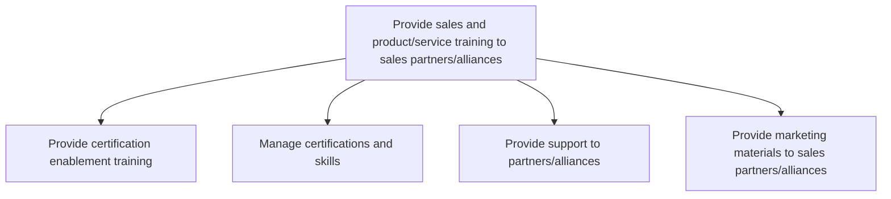
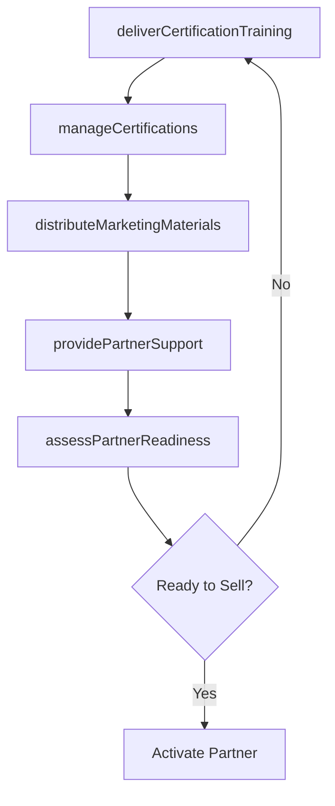

# Provide sales and product/service training to sales partners/alliances

> Business-as-Code definition for partner sales training and enablement. Models the delivery of product certification, skills management, partner support, and marketing material distribution to equip sales partners and alliances for success.

## Overview

Imparting guidance and instruction to sales partners/alliances concerning products/services. Distribute literature about the organization's products/services. Conduct workshops. Disseminate useful media content to engage and enlighten partners. Create communities through group engagements.

## Process Hierarchy



## GraphDL

```yaml
provide:
  object: Sales And Product/service Training To Sales Partners/alliances
  actor: PartnerEnablementManager
  result: PartnerReadinessReport
```

## Actions

| Action | Description |
|--------|-------------|
| deliverCertificationTraining | Conduct product and sales certification programs for partners |
| manageCertifications | Track, issue, and renew partner certifications and skill records |
| providePartnerSupport | Deliver technical and sales support to partner teams |
| distributeMarketingMaterials | Share sales collateral, product guides, and campaign assets with partners |
| assessPartnerReadiness | Evaluate partner preparedness to sell products and services effectively |

## Events

| Event | Description |
|-------|-------------|
| certificationTrainingDelivered | Partner certification training session completed |
| certificationsManaged | Partner certifications issued, updated, or renewed |
| partnerSupportProvided | Support request from partner fulfilled |
| marketingMaterialsDistributed | Marketing materials shared with partner teams |
| partnerReadinessAssessed | Partner readiness evaluation completed |

## Searches

| Search | Description |
|--------|-------------|
| getPartnerCertifications | Retrieve partner certification status and expiration dates |
| getTrainingSchedule | Access upcoming partner training sessions and enrollment |
| getPartnerSupportTickets | Query partner support requests and resolution status |
| getMarketingMaterialsCatalog | Browse available marketing materials for partner distribution |

## Process Flow



## RACI Matrix

| Activity | Responsible | Accountable | Consulted | Informed |
|----------|-------------|-------------|-----------|----------|
| deliverCertificationTraining | PartnerTrainer | PartnerEnablementManager | ProductMarketing | ChannelSales |
| manageCertifications | PartnerOperationsCoordinator | PartnerEnablementManager | HR | ChannelSales |
| providePartnerSupport | PartnerSupportSpecialist | PartnerEnablementManager | PreSales | ChannelSales |
| distributeMarketingMaterials | ChannelMarketingSpecialist | PartnerEnablementManager | Marketing | ChannelSales |

## Sub-Processes

| ID | Name | Description |
|----|------|-------------|
| 3.5.5.1.1 | Provide certification enablement training | Provide training and certification to develop strategies for marketing-driven sales. |
| 3.5.5.1.2 | Manage certifications and skills | Reviewing, processing and issuing certifications and accrediting skills and competencies. |
| 3.5.5.1.3 | Provide support to partners/alliances | Backing sales partners and strategic alliances. |
| 3.5.5.1.4 | Provide marketing materials to sales partners/alliances | Distributing marketing materials and sales brochures to entities that the company partners with. |

## Related Processes

| Process | Relationship |
|---------|-------------|
| 3.5.5.2 Evaluate partner/alliance results | Downstream - training effectiveness measured through results |
| 3.4.2 Develop sales partner/alliance relationships | Upstream - partner agreements define training requirements |
| 3.3.10 Manage product marketing content | Upstream - product content provides training material |
| 3.5.1 Manage leads/opportunities | Downstream - trained partners generate qualified leads |

## Related Departments

| Department | Role |
|-----------|------|
| Partner Enablement | Designs and delivers partner training programs |
| Product Marketing | Provides product knowledge content and positioning materials |
| Channel Sales | Manages partner relationships and identifies training needs |
| Learning and Development | Supports training infrastructure and certification platforms |

## Related Occupations

| Occupation | Involvement |
|-----------|-------------|
| Partner Enablement Manager | Oversees partner training strategy and programs |
| Partner Trainer | Delivers product and sales training to partner teams |
| Channel Marketing Specialist | Creates and distributes partner marketing materials |
| Partner Operations Coordinator | Manages certification records and training logistics |

## KPIs

| KPI | Description | Unit |
|-----|-------------|------|
| Certification Completion Rate | Percentage of partners completing required certifications | % |
| Training Satisfaction Score | Partner satisfaction with training programs | Score (1-5) |
| Time to Certification | Average days from partner onboarding to certification | Days |
| Certified Partner Revenue | Revenue generated by fully certified partners | USD |
| Material Utilization Rate | Percentage of distributed materials actively used by partners | % |

## Usage

```typescript
import { provideSalesAndProductServiceTrainingToSalesPartnersAlliances } from '@headlessly/provide-sales-and-product-service-training-to-sales-partners-alliances'

const training = provideSalesAndProductServiceTrainingToSalesPartnersAlliances()

// Deliver certification training to a partner cohort
const session = await training.deliverCertificationTraining({
  partners: ['partner-001', 'partner-002'],
  program: 'platform-sales-certification',
  format: 'virtual-workshop',
  duration: { hours: 8 }
})

// Assess partner readiness after training
const readiness = await training.assessPartnerReadiness({
  partnerId: 'partner-001',
  assessmentAreas: ['product-knowledge', 'sales-methodology', 'demo-skills'],
  minimumPassScore: 80
})
```
