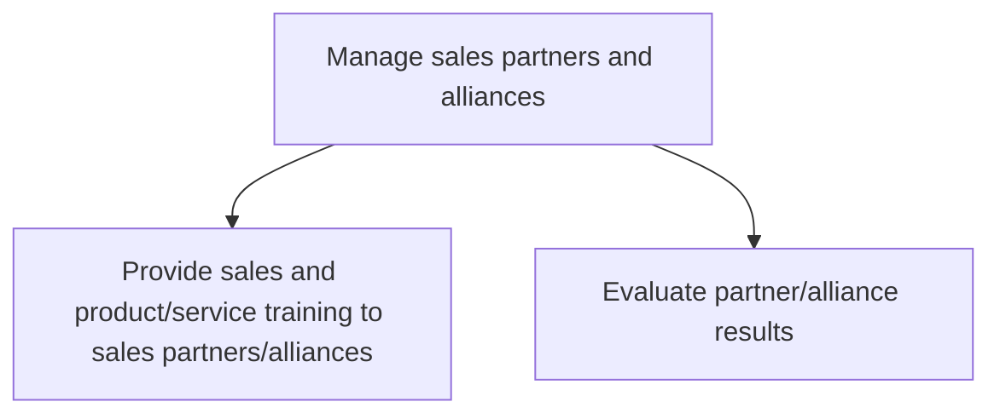
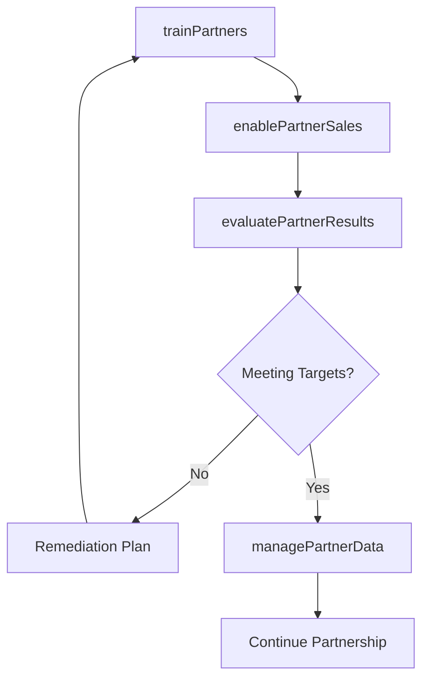

# Manage sales partners and alliances

> Business-as-Code definition for sales partner and alliance management. Models the operational enablement, training, performance evaluation, and ongoing management of sales partners and strategic alliances to maximize indirect revenue.

## Overview

Managing the organization's partners and alliances, with the objective of maximizing revenue. Train partners regarding the organization's portfolio of products/services. Craft sales forecasts. Examine their performance. Manage all data held by the organization on these partners.

## Process Hierarchy



## GraphDL

```yaml
manage:
  object: Sales Partners And Alliances
  actor: ChannelSalesManager
  result: PartnerPerformanceReport
```

## Actions

| Action | Description |
|--------|-------------|
| trainPartners | Deliver product knowledge and sales methodology training to partners |
| enablePartnerSales | Provide tools, collateral, and support for partner selling |
| evaluatePartnerResults | Assess partner performance against revenue and engagement targets |
| managePartnerData | Maintain accurate partner profiles, certifications, and agreements |

## Events

| Event | Description |
|-------|-------------|
| partnersTrained | Partner training programs delivered and completion tracked |
| partnerSalesEnabled | Partner enablement resources and tools distributed |
| partnerResultsEvaluated | Partner performance review completed |
| partnerDataManaged | Partner records and certifications updated |

## Searches

| Search | Description |
|--------|-------------|
| getPartnerPerformance | Retrieve partner revenue contribution and deal data |
| getPartnerCertifications | Access partner training completion and certification status |
| getPartnerRoster | Query active partner roster with tier and status |
| getPartnerForecast | Retrieve partner-sourced pipeline and forecast data |

## Process Flow



## RACI Matrix

| Activity | Responsible | Accountable | Consulted | Informed |
|----------|-------------|-------------|-----------|----------|
| trainPartners | PartnerEnablementManager | ChannelSalesManager | ProductMarketing | Sales |
| enablePartnerSales | PartnerEnablementManager | ChannelSalesManager | Marketing | SalesOperations |
| evaluatePartnerResults | ChannelSalesManager | VP Sales | Finance | ExecutiveTeam |
| managePartnerData | PartnerOperationsCoordinator | ChannelSalesManager | IT | Finance |

## Sub-Processes

| ID | Name | Description |
|----|------|-------------|
| 3.5.5.1 | Provide sales and product/service training to sales partners/alliances | Imparting guidance and instruction to sales partners/alliances concerning products/services. Distrib |
| 3.5.5.2 | Evaluate partner/alliance results | Examining the performance of its partners/alliances in selling its products/services. Use metrics su |

## Related Processes

| Process | Relationship |
|---------|-------------|
| 3.4.2 Develop sales partner/alliance relationships | Upstream - partner strategy guides operational management |
| 3.5.1 Manage leads/opportunities | Parallel - partner-sourced leads feed pipeline |
| 3.5.4 Manage sales orders | Downstream - partner deals generate sales orders |
| 3.3.6 Manage trade pricing, promotions and allowances | Parallel - trade programs apply to partner channels |

## Related Departments

| Department | Role |
|-----------|------|
| Channel Sales | Manages day-to-day partner relationships and performance |
| Partner Enablement | Designs and delivers partner training programs |
| Marketing | Provides co-marketing resources and campaign support |
| Sales Operations | Tracks partner pipeline and performance metrics |
| Legal | Manages partner agreement compliance |

## Related Occupations

| Occupation | Involvement |
|-----------|-------------|
| Channel Sales Manager | Oversees partner relationships and revenue targets |
| Partner Enablement Manager | Delivers training and enablement programs |
| Channel Marketing Specialist | Supports partner co-marketing activities |
| Partner Operations Coordinator | Manages partner data and administrative processes |

## KPIs

| KPI | Description | Unit |
|-----|-------------|------|
| Partner Revenue | Total revenue generated through partner channels | USD |
| Partner Training Completion | Percentage of partners completing required certifications | % |
| Partner Deal Registration Rate | Percentage of partner deals formally registered | % |
| Partner Satisfaction Score | Average partner satisfaction with support and enablement | Score (1-10) |
| Partner-Sourced Pipeline | Value of opportunities originated by partners | USD |

## Usage

```typescript
import { manageSalesPartnersAndAlliances } from '@headlessly/manage-sales-partners-and-alliances'

const partners = manageSalesPartnersAndAlliances()

// Deliver training to a partner cohort
const training = await partners.trainPartners({
  partners: ['partner-001', 'partner-002'],
  programs: ['product-certification', 'sales-methodology'],
  deadline: '2026-03-31'
})

// Evaluate partner performance
const results = await partners.evaluatePartnerResults({
  period: 'Q1-2026',
  metrics: ['revenue', 'dealRegistrations', 'certificationRate'],
  compareToTargets: true
})
```
