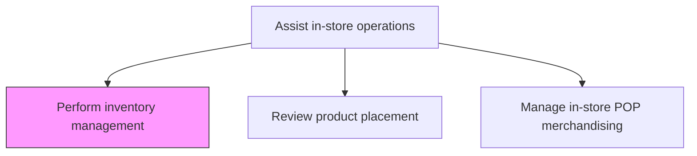
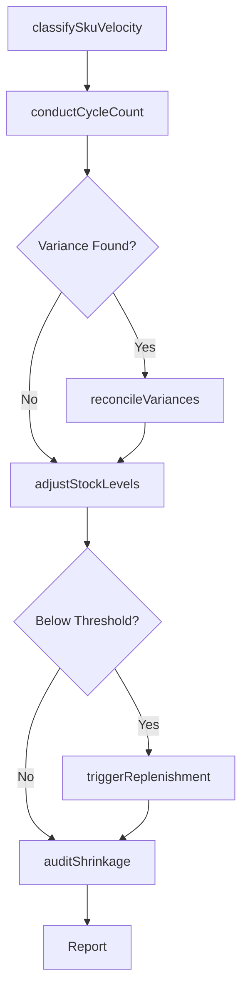

# Perform inventory management

> Business-as-Code definition for in-store inventory management. Models the process of tracking stock levels, conducting cycle counts, managing replenishment triggers, and ensuring shelf availability at retail locations.

## Overview

Performing in-store inventory management to maintain optimal stock levels for retail operations. Monitor product availability on shelves, track inventory movements across the store, conduct periodic cycle counts, and trigger replenishment orders when stock falls below defined thresholds. Coordinate with warehouse and distribution teams to prevent out-of-stock and overstock conditions.

## Process Hierarchy



## GraphDL

```yaml
perform:
  object: Inventory Management
  actor: StoreInventoryManager
  result: InventoryStatusReport
```

## Actions

| Action | Description |
|--------|-------------|
| conductCycleCount | Perform physical count of products in a specific section or category |
| reconcileVariances | Compare physical counts against system records and resolve discrepancies |
| triggerReplenishment | Initiate reorder when stock levels fall below minimum threshold |
| adjustStockLevels | Update inventory records after receiving, returns, or write-offs |
| classifySkuVelocity | Categorize products by sales velocity for stocking priority |
| auditShrinkage | Investigate and document inventory losses from theft, damage, or error |

## Events

| Event | Description |
|-------|-------------|
| cycleCountCompleted | Physical inventory count for a section has been finished |
| varianceReconciled | Discrepancy between physical and system counts resolved |
| replenishmentTriggered | Reorder request generated for low-stock items |
| stockLevelAdjusted | Inventory quantity updated in the system |
| shrinkageAudited | Inventory loss investigation completed and documented |
| skuVelocityClassified | Product categorized by sales velocity tier |

## Searches

| Search | Description |
|--------|-------------|
| findLowStockItems | List products at or below reorder point by location |
| getInventorySnapshot | Retrieve current stock levels for a store or section |
| getVarianceHistory | Retrieve past discrepancies between physical and system counts |
| getShrinkageReport | Get inventory loss data by category, location, or time period |

## Process Flow



## RACI Matrix

| Activity | Responsible | Accountable | Consulted | Informed |
|----------|-------------|-------------|-----------|----------|
| conductCycleCount | StoreAssociate | StoreManager | InventoryAnalyst | RegionalManager |
| reconcileVariances | InventoryAnalyst | StoreManager | FinanceTeam | LossPreventionTeam |
| triggerReplenishment | InventoryAnalyst | StoreManager | DistributionCenter | Merchandiser |
| auditShrinkage | LossPreventionTeam | StoreManager | SecurityTeam | RegionalManager |

## Related Processes

| Process | Relationship |
|---------|-------------|
| 3.5.6 Assist in-store operations | Parent process |
| 3.5.6.2 Review product placement | Sibling - shelf inventory feeds placement reviews |
| 4.4.3.4 Pick, pack, and ship product for delivery | Upstream - fulfills replenishment orders |
| 3.5.4 Manage sales orders | Downstream - inventory availability drives order promising |

## Related Departments

| Department | Role |
|-----------|------|
| Store Operations | Primary owner of daily inventory processes |
| Loss Prevention | Investigates shrinkage and theft |
| Distribution | Fulfills store replenishment requests |
| Merchandising | Sets stocking standards and planogram compliance |

## Related Occupations

| Occupation | Involvement |
|-----------|-------------|
| Inventory Control Specialist | Executes cycle counts and reconciliation |
| Store Manager | Accountable for store inventory accuracy |
| Loss Prevention Analyst | Investigates shrinkage patterns |

## KPIs

| KPI | Description | Unit |
|-----|-------------|------|
| Inventory Accuracy | Percentage match between physical and system counts | % |
| Shrinkage Rate | Value of inventory loss as percentage of sales | % |
| In-Stock Rate | Percentage of SKUs available on shelf | % |
| Days of Supply | Average inventory on hand relative to daily sales | Days |

## Usage

```typescript
import { performInventoryManagement } from '@headlessly/perform-inventory-management'

const inventory = performInventoryManagement()

// Conduct cycle count for a store section
const countResult = await inventory.conductCycleCount({
  storeId: 'store-142',
  section: 'frozen-foods',
  countDate: '2024-11-15'
})

// Check for low-stock items needing replenishment
const lowStock = await inventory.findLowStockItems({
  storeId: 'store-142',
  threshold: 'reorderPoint'
})

// Trigger replenishment for items below threshold
await inventory.triggerReplenishment({
  items: lowStock.map(item => item.skuId),
  priority: 'standard'
})
```
