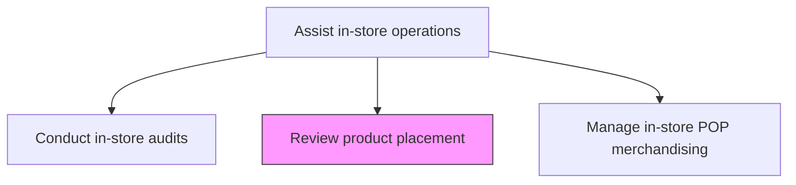
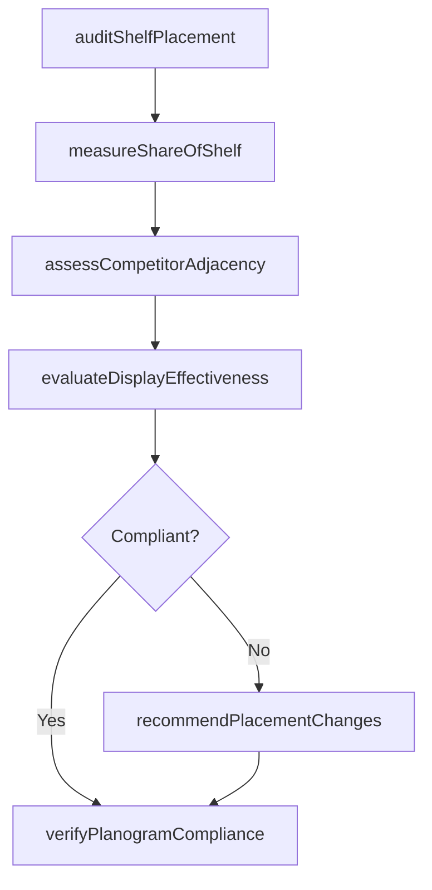

# Review product placement

> Business-as-Code definition for retail product placement review. Models the assessment and optimization of product shelf positioning, planogram compliance, and display effectiveness across retail locations.

## Overview

Evaluate product placement within retail locations to ensure optimal shelf positioning, planogram compliance, and visual merchandising effectiveness. Audit store layouts, assess competitor adjacency, measure facings and share-of-shelf, and recommend placement adjustments to maximize product visibility and sales velocity.

## Process Hierarchy



## GraphDL

```yaml
review:
  object: Product Placement
  actor: MerchandisingAnalyst
  result: PlacementReviewReport
```

## Actions

| Action | Description |
|--------|-------------|
| auditShelfPlacement | Inspect current product positioning against approved planograms |
| measureShareOfShelf | Calculate the percentage of shelf space allocated to the organization's products |
| assessCompetitorAdjacency | Evaluate competitor product positioning relative to own products |
| evaluateDisplayEffectiveness | Measure the visual impact and accessibility of product displays |
| recommendPlacementChanges | Propose shelf positioning adjustments based on audit findings and sales data |
| verifyPlanogramCompliance | Confirm that retail locations adhere to agreed-upon shelf layout plans |

## Events

| Event | Description |
|-------|-------------|
| shelfPlacementAudited | Product shelf positioning inspected against planogram |
| shareOfShelfMeasured | Shelf space allocation calculated for current period |
| competitorAdjacencyAssessed | Competitor positioning analysis completed |
| displayEffectivenessEvaluated | Visual impact and accessibility of displays measured |
| placementChangesRecommended | Shelf adjustment proposals generated from audit findings |
| planogramComplianceVerified | Retail location planogram adherence confirmed |

## Searches

| Search | Description |
|--------|-------------|
| getPlacementAudits | Retrieve placement audit results by store, region, or product |
| getShareOfShelfMetrics | Query share-of-shelf data by category, retailer, or time period |
| getPlanogramCompliance | Look up compliance rates by store or retail chain |
| getPlacementRecommendations | Retrieve pending placement change recommendations |

## Process Flow



## RACI Matrix

| Activity | Responsible | Accountable | Consulted | Informed |
|----------|-------------|-------------|-----------|----------|
| auditShelfPlacement | FieldMerchandiser | MerchandisingManager | RetailAccountManager | CategoryManager |
| measureShareOfShelf | MerchandisingAnalyst | MerchandisingManager | Sales | Marketing |
| recommendPlacementChanges | MerchandisingAnalyst | MerchandisingManager | CategoryManager | RetailBuyer |

## Related Processes

| Process | Relationship |
|---------|-------------|
| 3.5.6.3 Manage in-store POP merchandising | Parallel - placement informs POP display strategy |
| 3.5.6.1 Conduct in-store audits | Upstream - audits provide the data for placement reviews |
| 3.3.9 Develop and manage packaging strategy | Upstream - packaging design affects shelf visibility |

## Related Departments

| Department | Role |
|-----------|------|
| Merchandising | Conducts placement audits and recommends changes |
| Trade Marketing | Negotiates shelf positioning with retailers |
| Sales | Maintains retailer relationships that influence placement |

## Related Occupations

| Occupation | Involvement |
|-----------|-------------|
| Field Merchandiser | Conducts in-store placement audits and captures shelf data |
| Merchandising Analyst | Analyzes share-of-shelf metrics and generates recommendations |
| Category Manager | Oversees product placement strategy within retail categories |

## KPIs

| KPI | Description | Unit |
|-----|-------------|------|
| Share of Shelf | Percentage of total shelf space occupied by the organization's products | % |
| Planogram Compliance Rate | Percentage of stores adhering to approved planogram layouts | % |
| Placement Improvement Rate | Percentage of recommended placement changes successfully implemented | % |
| Sales Lift from Placement | Revenue increase attributable to product placement optimization | % |

## Usage

```typescript
import { reviewProductPlacement } from '@headlessly/review-product-placement'

const placement = reviewProductPlacement()

// Audit shelf placement across a retail chain
const audit = await placement.auditShelfPlacement({
  retailer: 'national-grocery-chain',
  region: 'northeast',
  productCategory: 'beverages',
  capturePhotos: true
})

// Measure share of shelf for the current quarter
const shareOfShelf = await placement.measureShareOfShelf({
  retailer: 'national-grocery-chain',
  category: 'beverages',
  period: 'Q1-2026',
  compareWith: ['competitor-a', 'competitor-b']
})
```
