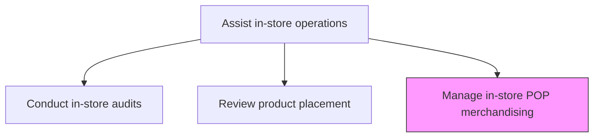
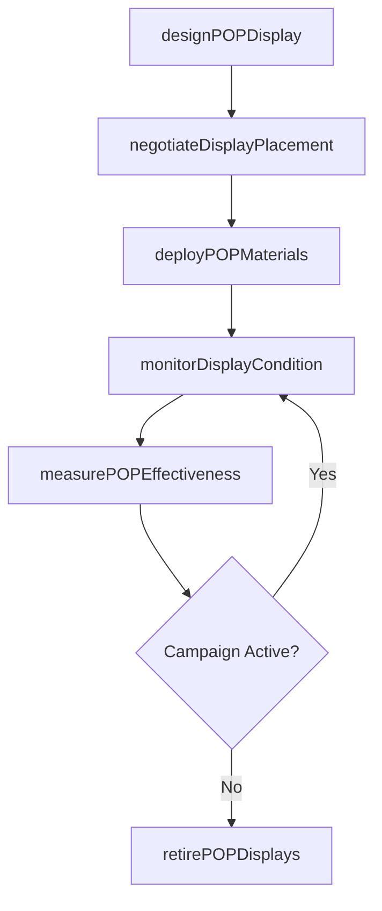

# Manage in-store POP (Point of Purchase) merchandising

> Business-as-Code definition for point-of-purchase merchandising management. Models the planning, deployment, monitoring, and optimization of in-store POP displays, signage, and promotional fixtures across retail locations.

## Overview

Plan, deploy, and manage point-of-purchase displays, promotional signage, endcap fixtures, and branded retail installations. Coordinate with retailers on display placement agreements, track display deployment and condition, measure the sales impact of POP materials, and manage the lifecycle from design through removal.

## Process Hierarchy



## GraphDL

```yaml
manage:
  object: In-store POP (Point Of Purchase) Merchandising
  actor: POPMerchandisingManager
  result: POPDisplayDeployment
```

## Actions

| Action | Description |
|--------|-------------|
| designPOPDisplay | Create point-of-purchase display concepts aligned with brand guidelines and campaign objectives |
| negotiateDisplayPlacement | Secure retail display locations through retailer agreements and trade allowances |
| deployPOPMaterials | Ship, assemble, and install POP displays and signage at designated retail locations |
| monitorDisplayCondition | Track the physical condition and compliance of deployed POP displays across stores |
| measurePOPEffectiveness | Analyze sales lift, foot traffic, and conversion data attributable to POP displays |
| retirePOPDisplays | Remove outdated or campaign-expired POP materials and coordinate disposal or recycling |

## Events

| Event | Description |
|-------|-------------|
| popDisplayDesigned | POP display concept finalized and approved for production |
| displayPlacementNegotiated | Retail display location agreements secured |
| popMaterialsDeployed | POP displays installed at designated retail locations |
| displayConditionMonitored | POP display condition audit completed across stores |
| popEffectivenessMeasured | Sales lift and engagement data analyzed for POP displays |
| popDisplaysRetired | Expired POP materials removed from retail locations |

## Searches

| Search | Description |
|--------|-------------|
| getPOPDeployments | Retrieve POP display deployments by retailer, region, or campaign |
| getDisplayConditionReports | Query display condition audit results by store or status |
| getPOPPerformanceMetrics | Look up sales lift and engagement metrics for POP displays |
| getActiveDisplayAgreements | Retrieve current retailer display placement agreements |

## Process Flow



## RACI Matrix

| Activity | Responsible | Accountable | Consulted | Informed |
|----------|-------------|-------------|-----------|----------|
| designPOPDisplay | POPMerchandisingManager | VP TradeMarketing | CreativeTeam | RetailAccountManager |
| deployPOPMaterials | FieldMerchandiser | POPMerchandisingManager | RetailOperations | StoreManager |
| measurePOPEffectiveness | MerchandisingAnalyst | POPMerchandisingManager | Sales | Marketing |
| retirePOPDisplays | FieldMerchandiser | POPMerchandisingManager | Sustainability | RetailOperations |

## Related Processes

| Process | Relationship |
|---------|-------------|
| 3.5.6.2 Review product placement | Upstream - placement reviews inform POP display positioning |
| 3.5.6.1 Conduct in-store audits | Parallel - audits verify POP display compliance and condition |
| 3.3.5 Develop and manage consumer promotions | Upstream - consumer promotions drive POP campaign requirements |

## Related Departments

| Department | Role |
|-----------|------|
| Trade Marketing | Designs and manages POP display programs |
| Field Merchandising | Deploys and maintains POP materials in stores |
| Creative Services | Designs POP display graphics and brand-compliant assets |

## Related Occupations

| Occupation | Involvement |
|-----------|-------------|
| POP Merchandising Manager | Leads POP display program strategy and retailer negotiations |
| Field Merchandiser | Installs, inspects, and retires POP displays at retail locations |
| Merchandising Analyst | Measures POP display performance and recommends optimizations |

## KPIs

| KPI | Description | Unit |
|-----|-------------|------|
| POP Display Deployment Rate | Percentage of planned POP displays successfully installed on time | % |
| Display Compliance Rate | Percentage of deployed displays meeting condition and placement standards | % |
| POP Sales Lift | Average incremental revenue generated by POP display presence | % |
| Cost per Display Impression | Total POP program cost divided by estimated shopper impressions | $ |

## Usage

```typescript
import { manageInStorePOPMerchandising } from '@headlessly/manage-in-store-pop-point-of-purchase-merchandising'

const pop = manageInStorePOPMerchandising()

// Deploy POP materials for a new campaign
const deployment = await pop.deployPOPMaterials({
  campaign: 'summer-beverage-launch-2026',
  displayType: 'endcap-with-header',
  retailers: ['national-grocery-chain', 'regional-drug-stores'],
  storeCount: 1200,
  installWindow: { start: '2026-05-01', end: '2026-05-15' }
})

// Measure POP display effectiveness
const performance = await pop.measurePOPEffectiveness({
  campaign: 'summer-beverage-launch-2026',
  metrics: ['sales-lift', 'foot-traffic', 'units-per-store'],
  compareWith: 'non-display-stores',
  period: 'last-30-days'
})
```
