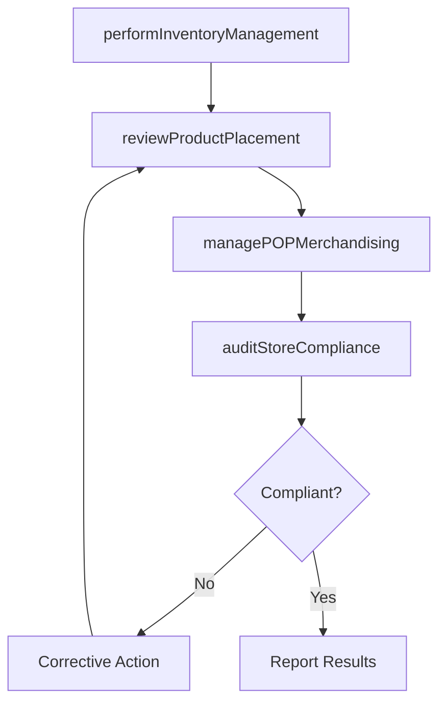

# Assist in store operations

> Business-as-Code definition for in-store operations support. Models the sales team's involvement in retail store activities including inventory management, product placement optimization, and point-of-purchase merchandising execution.

## Overview

Supporting retail and physical store operations by assisting with inventory management, optimizing product placement on shelves and displays, and managing in-store point-of-purchase merchandising. Coordinate with store managers and merchandising teams to ensure products are properly stocked, positioned, and presented to maximize customer visibility and sales conversion.

## Process Hierarchy

```mermaid
graph TD
    A[Assist in store operations]
    A --> B[Perform inventory management]
    A --> C[Review product placement]
    A --> D[Manage in-store POP (Point of Purchase) merchandising]
```

## GraphDL

```yaml
assist:
  object: In Store Operations
  actor: FieldMerchandisingRepresentative
  result: StoreOperationsReport
```

## Actions

| Action | Description |
|--------|-------------|
| performInventoryManagement | Monitor and manage in-store inventory levels and replenishment |
| reviewProductPlacement | Evaluate and optimize shelf placement and product positioning |
| managePOPMerchandising | Execute point-of-purchase displays and merchandising programs |
| auditStoreCompliance | Verify store execution against planograms and display standards |

## Events

| Event | Description |
|-------|-------------|
| inventoryManaged | In-store inventory levels reviewed and replenishment initiated |
| productPlacementReviewed | Product placement evaluation completed with recommendations |
| popMerchandisingManaged | POP displays installed or updated per merchandising plan |
| storeComplianceAudited | Store merchandising compliance audit completed |

## Searches

| Search | Description |
|--------|-------------|
| getStoreInventory | Retrieve in-store inventory levels by product and location |
| getPlacementCompliance | Access planogram compliance data by store |
| getPOPDisplayStatus | Query point-of-purchase display installation and condition |
| getStorePerformance | Retrieve sales performance by store location |

## Process Flow



## RACI Matrix

| Activity | Responsible | Accountable | Consulted | Informed |
|----------|-------------|-------------|-----------|----------|
| performInventoryManagement | FieldMerchandisingRepresentative | StoreOperationsManager | SupplyChain | Sales |
| reviewProductPlacement | MerchandisingAnalyst | StoreOperationsManager | CategoryManager | Marketing |
| managePOPMerchandising | FieldMerchandisingRepresentative | StoreOperationsManager | Marketing | BrandManager |
| auditStoreCompliance | StoreOperationsManager | VP Sales | Merchandising | ExecutiveTeam |

## Sub-Processes

| ID | Name | Description |
|----|------|-------------|
| 3.5.6.1 | Perform inventory management | Monitoring and managing in-store inventory levels, conducting stock counts, and initiating replenishment orders to maintain optimal product availability on shelves. |
| 3.5.6.2 | Review product placement | Evaluating product shelf positioning, planogram compliance, share-of-shelf metrics, and competitor adjacency to optimize product visibility and sales velocity in retail locations. |
| 3.5.6.3 | Manage in-store POP (Point of Purchase) merchandising | Planning, deploying, monitoring, and retiring point-of-purchase displays, promotional signage, and branded retail fixtures to drive impulse purchases and brand awareness. |

## Related Processes

| Process | Relationship |
|---------|-------------|
| 3.5.4 Manage sales orders | Upstream - sales orders drive inventory replenishment |
| 3.4.3 Perform category management | Upstream - category strategy guides product placement |
| 3.3.6 Manage trade pricing, promotions and allowances | Parallel - trade promotions affect in-store displays |
| 4.0 Deliver Products and Services | Parallel - delivery operations feed store inventory |

## Related Departments

| Department | Role |
|-----------|------|
| Field Merchandising | Executes in-store product placement and display management |
| Store Operations | Manages day-to-day store logistics and compliance |
| Supply Chain | Ensures inventory replenishment to stores |
| Marketing | Designs POP materials and merchandising guidelines |
| Category Management | Defines planograms and product assortment |

## Related Occupations

| Occupation | Involvement |
|-----------|-------------|
| Field Merchandising Representative | Manages in-store product displays and inventory |
| Store Operations Manager | Oversees store execution and compliance |
| Merchandising Analyst | Evaluates product placement effectiveness |
| Visual Merchandiser | Designs store displays and POP materials |

## KPIs

| KPI | Description | Unit |
|-----|-------------|------|
| Planogram Compliance Rate | Percentage of stores meeting product placement standards | % |
| In-Stock Rate | Percentage of SKUs available on shelf at any given time | % |
| Display Execution Rate | Percentage of POP displays installed per plan | % |
| Sales Per Square Foot | Revenue generated per unit of retail space | USD |

## Usage

```typescript
import { assistInStoreOperations } from '@headlessly/assist-in-store-operations'

const storeOps = assistInStoreOperations()

// Review product placement compliance across stores
const placement = await storeOps.reviewProductPlacement({
  stores: ['store-001', 'store-002', 'store-003'],
  categories: ['analytics', 'platform'],
  compareToPlanogram: true
})

// Manage POP merchandising for a promotion
const pop = await storeOps.managePOPMerchandising({
  campaign: 'spring-promotion-2026',
  displayType: 'end-cap',
  stores: placement.nonCompliantStores
})
```
