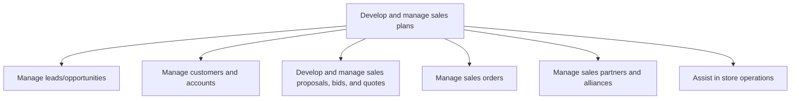
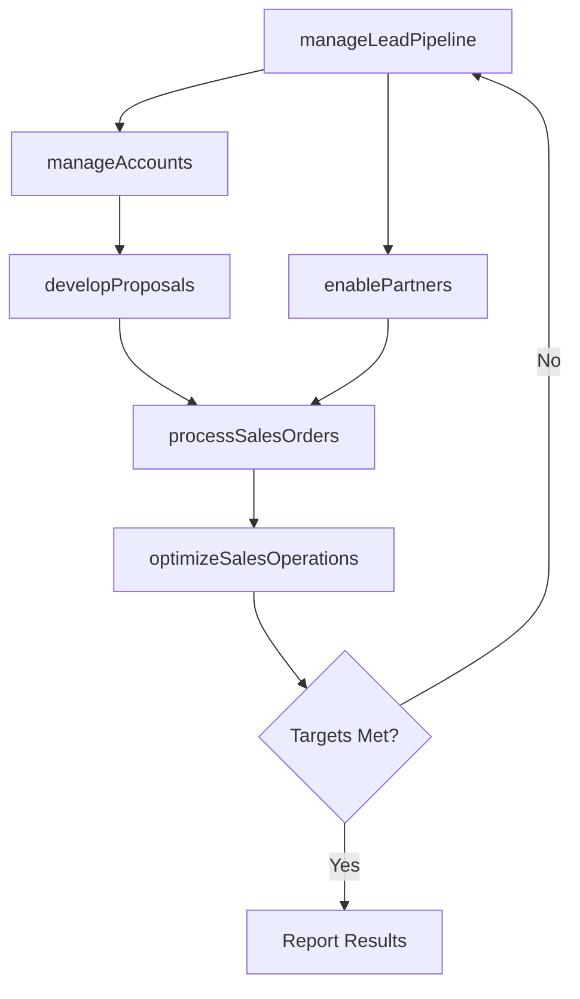

# Develop and manage sales plans

> Business-as-Code definition for sales plan execution and management. Models the end-to-end sales lifecycle from lead generation through order management, including account management, proposal development, and partner enablement.

## Overview

Selling products/services. Set appropriate customer expectations. Work with customers using the same schedule that product/service development, production, and customer service functions follow. Manage sales personnel and sales partnerships/alliances.

## Process Hierarchy



## GraphDL

```yaml
develop:
  object: And Manage Sales Plans
  actor: SalesManager
  result: SalesExecutionPlan
```

## Actions

| Action | Description |
|--------|-------------|
| manageLeadPipeline | Generate, qualify, and nurture leads through the sales funnel |
| manageAccounts | Develop and execute account plans for key customers |
| developProposals | Create and manage sales proposals, bids, and quotes |
| processSalesOrders | Accept, validate, and fulfill customer sales orders |
| enablePartners | Train and support sales partners and alliances |
| optimizeSalesOperations | Continuously improve sales processes and performance |

## Events

| Event | Description |
|-------|-------------|
| leadPipelineManaged | Lead pipeline metrics updated and qualified leads advanced |
| accountsManaged | Account plans reviewed and customer relationships maintained |
| proposalsDeveloped | Sales proposals submitted to customers |
| salesOrdersProcessed | Customer orders accepted and entered for fulfillment |
| partnersEnabled | Partner training and enablement programs delivered |
| salesOperationsOptimized | Sales process improvements implemented |

## Searches

| Search | Description |
|--------|-------------|
| getLeadPipeline | Retrieve lead and opportunity pipeline by stage and rep |
| getAccountPlans | Query account plans by tier, industry, or territory |
| getSalesOrders | Access sales order data by status, customer, or period |
| getProposalStatus | Track proposal and bid status through approval workflow |
| getPartnerPerformance | Retrieve partner sales performance and certification data |

## Process Flow



## RACI Matrix

| Activity | Responsible | Accountable | Consulted | Informed |
|----------|-------------|-------------|-----------|----------|
| manageLeadPipeline | SalesDevelopmentRep | SalesManager | Marketing | ProductManagement |
| manageAccounts | AccountExecutive | VP Sales | CustomerSuccess | Finance |
| developProposals | SolutionArchitect | SalesManager | Legal | Finance |
| processSalesOrders | SalesOperationsManager | VP Sales | Fulfillment | Finance |
| enablePartners | PartnerEnablementManager | ChannelDirector | Marketing | Sales |

## Sub-Processes

| ID | Name | Description |
|----|------|-------------|
| 3.5.1 | Manage leads/opportunities | Generating leads of prospective customers to grow the organization's business. Identify viable custo |
| 3.5.2 | Manage customers and accounts | Managing the customer's expectations, with the intent of responsibly increasing the sale of the orga |
| 3.5.3 | Develop and manage sales proposals, bids, and quotes | Understanding and refining the customer requirements as provided in a RFP (Request for Proposal) or  |
| 3.5.4 | Manage sales orders | Taking, receiving, processing, and acknowledging new customer orders or amendments to outstanding cu |
| 3.5.5 | Manage sales partners and alliances | Managing the organization's partners and alliances, with the objective of maximizing revenue. Train  |
| 3.5.6 | Assist in store operations | Supporting retail and physical store operations by assisting with inventory management, optimizing product placement on shelves, and managing in-store point-of-purchase merchandising. |

## Related Processes

| Process | Relationship |
|---------|-------------|
| 3.4 Develop trade customer sales strategy | Upstream - sales strategy guides plan execution |
| 3.3 Develop and manage marketing plans | Parallel - marketing plans generate demand for sales |
| 4.0 Deliver Products and Services | Downstream - orders flow to fulfillment |
| 5.0 Manage Customer Service | Downstream - post-sale service and support |

## Related Departments

| Department | Role |
|-----------|------|
| Sales | Owns lead management, account planning, and deal execution |
| Sales Operations | Manages order processing, pipeline analytics, and forecasting |
| Pre-Sales | Supports proposal development and solution architecture |
| Channel Sales | Manages partner enablement and indirect sales |
| Legal | Reviews contracts and terms for proposals and orders |

## Related Occupations

| Occupation | Involvement |
|-----------|-------------|
| Account Executive | Manages customer relationships and closes deals |
| Sales Development Representative | Generates and qualifies leads |
| Solution Architect | Designs solutions for complex proposals |
| Sales Operations Manager | Manages order processing and pipeline analytics |

## KPIs

| KPI | Description | Unit |
|-----|-------------|------|
| Pipeline Velocity | Average days from lead to closed deal | Days |
| Win Rate | Percentage of proposals resulting in closed business | % |
| Average Deal Size | Mean revenue per closed deal | USD |
| Quota Attainment | Percentage of sales reps achieving quota | % |
| Order Accuracy | Percentage of orders processed without errors | % |

## Usage

```typescript
import { developAndManageSalesPlans } from '@headlessly/develop-and-manage-sales-plans'

const sales = developAndManageSalesPlans()

// Manage the lead pipeline
const pipeline = await sales.manageLeadPipeline({
  stage: 'qualified',
  minDealSize: 50000,
  territory: 'North America'
})

// Develop a proposal for a key opportunity
const proposal = await sales.developProposals({
  opportunityId: pipeline[0].id,
  includeCustomPricing: true,
  requiresLegalReview: true
})
```
