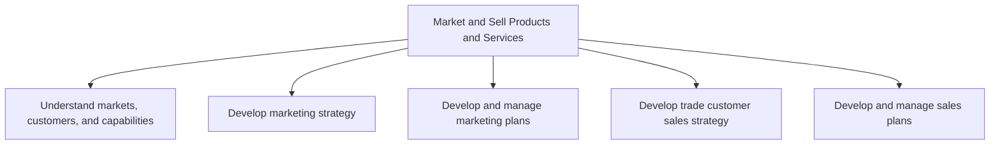
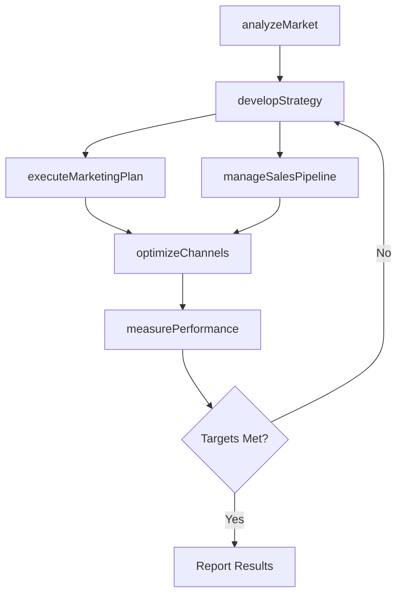

# Market and Sell Products and Services

> Business-as-Code definition for the end-to-end commercial revenue generation lifecycle. Models market intelligence gathering, marketing strategy development, campaign execution, sales planning, and channel management as programmable processes.

## Overview

Outlining process groups related to understanding markets, customers, and capabilities; developing marketing strategies; executing marketing plans; developing sales strategies; developing and managing marketing plans; and managing sales partners and alliances.

## Process Hierarchy



## GraphDL

```yaml
market:
  object: And Sell Products And Services
  actor: ChiefMarketingOfficer
  result: RevenueGrowthOutcome
```

## Actions

| Action | Description |
|--------|-------------|
| analyzeMarket | Gather and synthesize market intelligence across segments and geographies |
| developStrategy | Formulate marketing and sales strategies aligned with business objectives |
| executeMarketingPlan | Launch and manage marketing campaigns across channels |
| manageSalesPipeline | Oversee the end-to-end sales process from lead to close |
| optimizeChannels | Evaluate and refine go-to-market channel mix for maximum reach |
| measurePerformance | Track revenue, conversion, and customer acquisition metrics |

## Events

| Event | Description |
|-------|-------------|
| marketAnalyzed | Market intelligence analysis completed and insights documented |
| strategyDeveloped | Marketing or sales strategy formally approved |
| marketingPlanExecuted | Marketing campaign or program launched |
| salesPipelineUpdated | Sales pipeline metrics refreshed with current opportunity data |
| channelsOptimized | Channel performance review completed with updated allocations |
| performanceMeasured | Revenue and conversion metrics reported to stakeholders |

## Searches

| Search | Description |
|--------|-------------|
| getMarketInsights | Retrieve market intelligence reports by segment or region |
| getCampaignPerformance | Query marketing campaign metrics and ROI data |
| getSalesPipeline | List sales opportunities filtered by stage, value, or rep |
| getChannelMetrics | Retrieve performance data by distribution channel |
| getRevenueForecasts | Query projected revenue by product line or territory |

## Process Flow



## RACI Matrix

| Activity | Responsible | Accountable | Consulted | Informed |
|----------|-------------|-------------|-----------|----------|
| analyzeMarket | MarketResearchManager | CMO | ProductManagement | ExecutiveTeam |
| developStrategy | MarketingDirector | CMO | Finance | SalesLeadership |
| executeMarketingPlan | CampaignManager | MarketingDirector | CreativeTeam | Sales |
| manageSalesPipeline | SalesManager | VP Sales | Marketing | Finance |
| measurePerformance | MarketingAnalyst | CMO | Finance | Board |

## Sub-Processes

| ID | Name | Description |
|----|------|-------------|
| 3.1 | Understand markets, customers, and capabilities | Making sense of the market and customers to identify the right opportunities to be capitalized, give |
| 3.2 | Develop marketing strategy | Charting a strategic course for marketing products/services. This will include defining the value pr |
| 3.3 | Develop and manage marketing plans | Translating marketing strategy into executable operational plans including goal setting, budgeting, campaign design, pricing management, promotions, customer analytics, and content management. |
| 3.4 | Develop trade customer sales strategy | Developing concrete plans for guiding and providing support to the sales function. Chart a road map  |
| 3.5 | Develop and manage sales plans | Selling products/services. Set appropriate customer expectations. Work with customers using the same |

## Related Processes

| Process | Relationship |
|---------|-------------|
| 1.0 Develop Vision and Strategy | Upstream - provides strategic direction for marketing |
| 2.0 Develop and Manage Products and Services | Parallel - products feed marketing and sales |
| 4.0 Deliver Products and Services | Downstream - fulfills orders generated by sales |
| 5.0 Manage Customer Service | Downstream - handles post-sale customer engagement |

## Related Departments

| Department | Role |
|-----------|------|
| Marketing | Primary owner of strategy development, campaigns, and brand management |
| Sales | Drives pipeline management, customer acquisition, and revenue generation |
| Product Management | Provides product positioning inputs and competitive intelligence |
| Finance | Controls budgets and measures return on marketing investment |
| Customer Success | Feeds retention insights and upsell opportunities back to sales |

## Related Occupations

| Occupation | Involvement |
|-----------|-------------|
| Marketing Manager | Orchestrates marketing strategy and campaign execution |
| Sales Representative | Manages customer relationships and closes deals |
| Market Research Analyst | Conducts market and competitive intelligence analysis |
| Brand Manager | Owns brand positioning and messaging |

## KPIs

| KPI | Description | Unit |
|-----|-------------|------|
| Customer Acquisition Cost | Average cost to acquire a new customer | USD |
| Marketing ROI | Return on marketing investment across all campaigns | % |
| Sales Conversion Rate | Percentage of qualified leads converted to customers | % |
| Revenue per Channel | Revenue generated per distribution channel | USD |
| Pipeline Velocity | Average time from lead to closed deal | Days |

## Usage

```typescript
import { marketAndSellProductsAndServices } from '@headlessly/market-and-sell-products-and-services'

const commercial = marketAndSellProductsAndServices()

// Analyze market conditions for a target segment
const insights = await commercial.analyzeMarket({
  segment: 'Enterprise',
  region: 'North America',
  includeCompetitors: true
})

// Measure campaign and pipeline performance
const metrics = await commercial.measurePerformance({
  quarter: 'Q4-2025',
  channels: ['direct', 'partner', 'digital']
})
```
