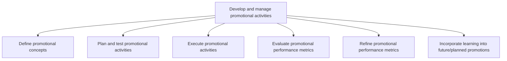

# Develop and manage promotional activities

> TODO: Business-as-Code definition for develop and manage promotional activities (retail)

## Overview

TODO: Add process overview

## Process Hierarchy



## GraphDL

```yaml
develop:
  object: And Manage Promotional Activities
  actor: TODO
  result: TODO
```

## Actions

| Action | Description |
|--------|-------------|
| TODO | TODO |

## Events

| Event | Description |
|-------|-------------|
| TODO | TODO |

## Searches

| Search | Description |
|--------|-------------|
| TODO | TODO |

## Process Flow


## RACI Matrix

| Activity | Responsible | Accountable | Consulted | Informed |
|----------|-------------|-------------|-----------|----------|
| TODO | TODO | TODO | TODO | TODO |

## Sub-Processes

| ID | Name | Description |
|----|------|-------------|
| 3.2.2.1 | Define promotional concepts | TODO |
| 3.2.2.2 | Plan and test promotional activities | TODO |
| 3.2.2.3 | Execute promotional activities | TODO |
| 3.2.2.4 | Evaluate promotional performance metrics | TODO |
| 3.2.2.5 | Refine promotional performance metrics | TODO |
| 3.2.2.6 | Incorporate learning into future/planned promotions | TODO |

## Related Processes

| Process | Relationship |
|---------|-------------|
| TODO | TODO |

## Related Departments

| Department | Role |
|-----------|------|
| TODO | TODO |

## Related Occupations

| Occupation | Involvement |
|-----------|-------------|
| TODO | TODO |

## KPIs

| KPI | Description | Unit |
|-----|-------------|------|
| TODO | TODO | TODO |

## Usage

```typescript
import { TODO } from '@headlessly/develop-and-manage-promotional-activities'

const client = TODO()

// TODO: Example action calls
```
