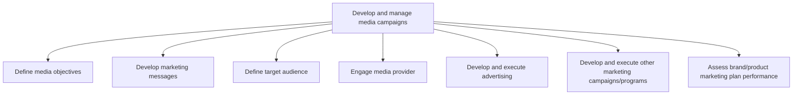

# Develop and manage media campaigns

> TODO: Business-as-Code definition for develop and manage media campaigns (retail)

## Overview

TODO: Add process overview

## Process Hierarchy



## GraphDL

```yaml
develop:
  object: And Manage Media Campaigns
  actor: TODO
  result: TODO
```

## Actions

| Action | Description |
|--------|-------------|
| TODO | TODO |

## Events

| Event | Description |
|-------|-------------|
| TODO | TODO |

## Searches

| Search | Description |
|--------|-------------|
| TODO | TODO |

## Process Flow


## RACI Matrix

| Activity | Responsible | Accountable | Consulted | Informed |
|----------|-------------|-------------|-----------|----------|
| TODO | TODO | TODO | TODO | TODO |

## Sub-Processes

| ID | Name | Description |
|----|------|-------------|
| 3.2.4.1 | Define media objectives | TODO |
| 3.2.4.2 | Develop marketing messages | TODO |
| 3.2.4.3 | Define target audience | TODO |
| 3.2.4.4 | Engage media provider | TODO |
| 3.2.4.5 | Develop and execute advertising | TODO |
| 3.2.4.6 | Develop and execute other marketing campaigns/programs | TODO |
| 3.2.4.7 | Assess brand/product marketing plan performance | TODO |

## Related Processes

| Process | Relationship |
|---------|-------------|
| TODO | TODO |

## Related Departments

| Department | Role |
|-----------|------|
| TODO | TODO |

## Related Occupations

| Occupation | Involvement |
|-----------|-------------|
| TODO | TODO |

## KPIs

| KPI | Description | Unit |
|-----|-------------|------|
| TODO | TODO | TODO |

## Usage

```typescript
import { TODO } from '@headlessly/develop-and-manage-media-campaigns'

const client = TODO()

// TODO: Example action calls
```
