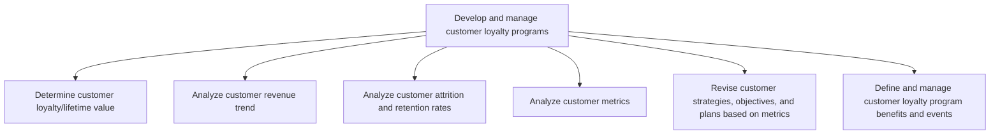

# Develop and manage customer loyalty programs

> TODO: Business-as-Code definition for develop and manage customer loyalty programs (retail)

## Overview

TODO: Add process overview

## Process Hierarchy



## GraphDL

```yaml
develop:
  object: And Manage Customer Loyalty Programs
  actor: TODO
  result: TODO
```

## Actions

| Action | Description |
|--------|-------------|
| TODO | TODO |

## Events

| Event | Description |
|-------|-------------|
| TODO | TODO |

## Searches

| Search | Description |
|--------|-------------|
| TODO | TODO |

## Process Flow


## RACI Matrix

| Activity | Responsible | Accountable | Consulted | Informed |
|----------|-------------|-------------|-----------|----------|
| TODO | TODO | TODO | TODO | TODO |

## Sub-Processes

| ID | Name | Description |
|----|------|-------------|
| 3.2.6.1 | Determine customer loyalty/lifetime value | TODO |
| 3.2.6.2 | Analyze customer revenue trend | TODO |
| 3.2.6.3 | Analyze customer attrition and retention rates | TODO |
| 3.2.6.4 | Analyze customer metrics | TODO |
| 3.2.6.5 | Revise customer strategies, objectives, and plans based on metrics | TODO |
| 3.2.6.6 | Define and manage customer loyalty program benefits and events | TODO |

## Related Processes

| Process | Relationship |
|---------|-------------|
| TODO | TODO |

## Related Departments

| Department | Role |
|-----------|------|
| TODO | TODO |

## Related Occupations

| Occupation | Involvement |
|-----------|-------------|
| TODO | TODO |

## KPIs

| KPI | Description | Unit |
|-----|-------------|------|
| TODO | TODO | TODO |

## Usage

```typescript
import { TODO } from '@headlessly/develop-and-manage-customer-loyalty-programs'

const client = TODO()

// TODO: Example action calls
```
