# Strategize production

> TODO: Business-as-Code definition for strategize production (automotive)

## Overview

TODO: Add process overview

## Process Hierarchy

```mermaid
graph TD
    A[Strategize production]
    A --> B[Review production practices]
    A --> C[Establish new practices]
    A --> D[Develop long range production strategy]
    A --> E[Define manufacturing goals]
    A --> F[Define labor and materials policies]
    A --> G[Define outsourcing policies]
    A --> H[Determine local labor and material regulations]
    A --> I[Define capital expense policies]
    A --> J[Define capacities]
    A --> K[Define production network and supply constraints]
    A --> L[Define production process]
    A --> M[Define standard operating procedures]
    A --> N[Define production workplace layout and infrastructure]
```



## GraphDL

```yaml
strategize:
  object: Production
  actor: TODO
  result: TODO
```

## Actions

| Action | Description |
|--------|-------------|
| TODO | TODO |

## Events

| Event | Description |
|-------|-------------|
| TODO | TODO |

## Searches

| Search | Description |
|--------|-------------|
| TODO | TODO |

## Process Flow


## RACI Matrix

| Activity | Responsible | Accountable | Consulted | Informed |
|----------|-------------|-------------|-----------|----------|
| TODO | TODO | TODO | TODO | TODO |

## Sub-Processes

| ID | Name | Description |
|----|------|-------------|
| 4.1.1.1 | Review production practices | TODO |
| 4.1.1.2 | Establish new practices | TODO |
| 4.1.1.3 | Develop long range production strategy | TODO |
| 4.1.1.4 | Define manufacturing goals | Creating quantifiable strategic objectives for each manufacturing segment in conjunction with sales  |
| 4.1.1.5 | Define labor and materials policies | Setting up internal rules and regulations regarding the employees and the materials. |
| 4.1.1.6 | Define outsourcing policies | Creating rules and regulations regarding contracting out of a business process to another party in o |
| 4.1.1.7 | Determine local labor and material regulations | TODO |
| 4.1.1.8 | Define capital expense policies | Designing rules and regulations pertaining to the expenditure incurred in acquiring or upgrading the |
| 4.1.1.9 | Define capacities | Outlining the manufacturing and processing capacities of the organization. Delineate the capabilitie |
| 4.1.1.10 | Define production network and supply constraints | Defining limitations in the ability of the organization's supply chain to deliver a new stock, and c |
| 4.1.1.11 | Define production process | Outlining the scheme of processing inventory into finished products/services. This includes the use  |
| 4.1.1.12 | Define standard operating procedures | Establishing or prescribing methods to be followed routinely for the performance of designated opera |
| 4.1.1.13 | Define production workplace layout and infrastructure | Determining the floor plans for the processing facility that is meant for delivering finished produc |

## Related Processes

| Process | Relationship |
|---------|-------------|
| TODO | TODO |

## Related Departments

| Department | Role |
|-----------|------|
| TODO | TODO |

## Related Occupations

| Occupation | Involvement |
|-----------|-------------|
| TODO | TODO |

## KPIs

| KPI | Description | Unit |
|-----|-------------|------|
| TODO | TODO | TODO |

## Usage

```typescript
import { TODO } from '@headlessly/strategize-production'

const client = TODO()

// TODO: Example action calls
```
