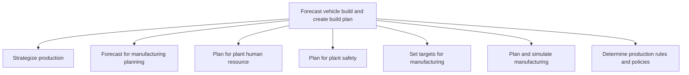

# Forecast vehicle build and create build plan

> TODO: Business-as-Code definition for forecast vehicle build and create build plan (automotive)

## Overview

This process group defines the parameters needed to create a build plan and includes the capacities, constraints and calendars against which sales orders can be matched. Production is strategized and planned and forecasting is conducted to support manufacturing planning. Thereafter, plant resource and safety planning is undertaken, manufacturing targets are set, manufacturing is planned and simulated (which helps to define outline purchase orders etc.) and production rules and policies are determined.

## Process Hierarchy



## GraphDL

```yaml
forecast:
  object: Vehicle Build And Create Build Plan
  actor: TODO
  result: TODO
```

## Actions

| Action | Description |
|--------|-------------|
| TODO | TODO |

## Events

| Event | Description |
|-------|-------------|
| TODO | TODO |

## Searches

| Search | Description |
|--------|-------------|
| TODO | TODO |

## Process Flow


## RACI Matrix

| Activity | Responsible | Accountable | Consulted | Informed |
|----------|-------------|-------------|-----------|----------|
| TODO | TODO | TODO | TODO | TODO |

## Sub-Processes

| ID | Name | Description |
|----|------|-------------|
| 4.1.1 | Strategize production | TODO |
| 4.1.2 | Forecast for manufacturing planning | TODO |
| 4.1.3 | Plan for plant human resource | TODO |
| 4.1.4 | Plan for plant safety | TODO |
| 4.1.5 | Set targets for manufacturing | TODO |
| 4.1.6 | Plan and simulate manufacturing | TODO |
| 4.1.7 | Determine production rules and policies | TODO |

## Related Processes

| Process | Relationship |
|---------|-------------|
| TODO | TODO |

## Related Departments

| Department | Role |
|-----------|------|
| TODO | TODO |

## Related Occupations

| Occupation | Involvement |
|-----------|-------------|
| TODO | TODO |

## KPIs

| KPI | Description | Unit |
|-----|-------------|------|
| TODO | TODO | TODO |

## Usage

```typescript
import { TODO } from '@headlessly/forecast-vehicle-build-and-create-build-plan'

const client = TODO()

// TODO: Example action calls
```
