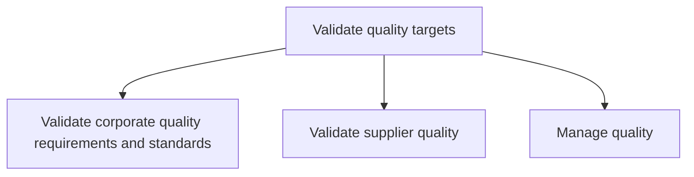

# Validate quality targets

> TODO: Business-as-Code definition for validate quality targets (automotive)

## Overview

Once the build plan and parameters for production are set, the quality targets for the process validate corporate quality requirements and standards need to be specified. Thereafter supplier quality is validated and quality is managed. Please note that numerous international and industry specific quality standards exist for whole product and components. As a result, the procedures for establishing and managing the standards are numerous. What is appropriate for one automotive firm may not be appropriate for another and a selection needs to be made, including what would overall fit a local market. Quality standards may be manufacturer and industry-specific. Once the selection of standards and procedures has been made they will need to be developed to fit the organizational structure, including the extension to suppliers and dealerships.

## Process Hierarchy



## GraphDL

```yaml
validate:
  object: Quality Targets
  actor: TODO
  result: TODO
```

## Actions

| Action | Description |
|--------|-------------|
| TODO | TODO |

## Events

| Event | Description |
|-------|-------------|
| TODO | TODO |

## Searches

| Search | Description |
|--------|-------------|
| TODO | TODO |

## Process Flow


## RACI Matrix

| Activity | Responsible | Accountable | Consulted | Informed |
|----------|-------------|-------------|-----------|----------|
| TODO | TODO | TODO | TODO | TODO |

## Sub-Processes

| ID | Name | Description |
|----|------|-------------|
| 4.2.1 | Validate corporate quality requirements and standards | TODO |
| 4.2.2 | Validate supplier quality | TODO |
| 4.2.3 | Manage quality | TODO |

## Related Processes

| Process | Relationship |
|---------|-------------|
| TODO | TODO |

## Related Departments

| Department | Role |
|-----------|------|
| TODO | TODO |

## Related Occupations

| Occupation | Involvement |
|-----------|-------------|
| TODO | TODO |

## KPIs

| KPI | Description | Unit |
|-----|-------------|------|
| TODO | TODO | TODO |

## Usage

```typescript
import { TODO } from '@headlessly/validate-quality-targets'

const client = TODO()

// TODO: Example action calls
```
