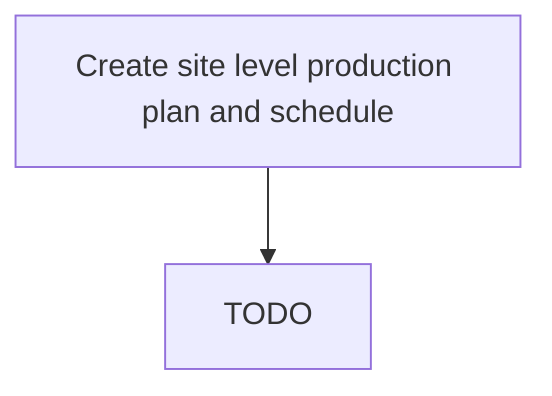

# Create site level production plan and schedule

> TODO: Business-as-Code definition for create site level production plan and schedule (automotive)

## Overview

Developing a plan and schedule for managing site-level production. Develop a timeline of activities to perform at the production site. Decide the timing and duration of every on-site activity.

## Process Hierarchy



## GraphDL

```yaml
create:
  object: Site Level Production Plan And Schedule
  actor: TODO
  result: TODO
```

## Actions

| Action | Description |
|--------|-------------|
| TODO | TODO |

## Events

| Event | Description |
|-------|-------------|
| TODO | TODO |

## Searches

| Search | Description |
|--------|-------------|
| TODO | TODO |

## Process Flow


## RACI Matrix

| Activity | Responsible | Accountable | Consulted | Informed |
|----------|-------------|-------------|-----------|----------|
| TODO | TODO | TODO | TODO | TODO |

## Related Processes

| Process | Relationship |
|---------|-------------|
| TODO | TODO |

## Related Departments

| Department | Role |
|-----------|------|
| TODO | TODO |

## Related Occupations

| Occupation | Involvement |
|-----------|-------------|
| TODO | TODO |

## KPIs

| KPI | Description | Unit |
|-----|-------------|------|
| TODO | TODO | TODO |

## Usage

```typescript
import { TODO } from '@headlessly/create-site-level-production-plan-and-schedule'

const client = TODO()

// TODO: Example action calls
```
