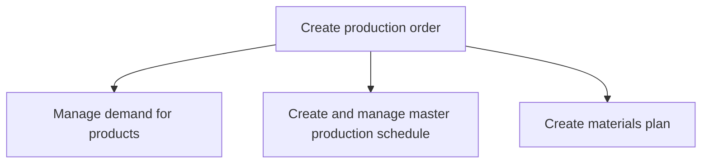

# Create production order

> TODO: Business-as-Code definition for create production order (automotive)

## Overview

This process group summarizes what is required to create a production order and addresses what happens to excess capacity or production shortages to balance capacity. The demand for products and services is managed (including the development of forecasts), the master production schedule is created and managed, and the materials plan is created in collaboration with suppliers and contract manufacturers. The creation of the materials plan relates to generating and dealing with a constrained parts plan. It is about volumes rather than specific delivery plans for inbound parts which are addressed in “plan for inbound parts”. (To create the production order, the sales forecast created in process group “plan and forecast vehicle” is matched with the short term production capability).

## Process Hierarchy



## GraphDL

```yaml
create:
  object: Production Order
  actor: TODO
  result: TODO
```

## Actions

| Action | Description |
|--------|-------------|
| TODO | TODO |

## Events

| Event | Description |
|-------|-------------|
| TODO | TODO |

## Searches

| Search | Description |
|--------|-------------|
| TODO | TODO |

## Process Flow


## RACI Matrix

| Activity | Responsible | Accountable | Consulted | Informed |
|----------|-------------|-------------|-----------|----------|
| TODO | TODO | TODO | TODO | TODO |

## Sub-Processes

| ID | Name | Description |
|----|------|-------------|
| 4.3.1 | Manage demand for products | Forecasting demand for products using secondary research and customer feedback. Refine these forecas |
| 4.3.2 | Create and manage master production schedule | Taking care of the master production plan. The master production includes creation and implementatio |
| 4.3.3 | Create materials plan | Developing a scheme that allows for advance planning for the availability of raw materials and spare |

## Related Processes

| Process | Relationship |
|---------|-------------|
| TODO | TODO |

## Related Departments

| Department | Role |
|-----------|------|
| TODO | TODO |

## Related Occupations

| Occupation | Involvement |
|-----------|-------------|
| TODO | TODO |

## KPIs

| KPI | Description | Unit |
|-----|-------------|------|
| TODO | TODO | TODO |

## Usage

```typescript
import { TODO } from '@headlessly/create-production-order'

const client = TODO()

// TODO: Example action calls
```
