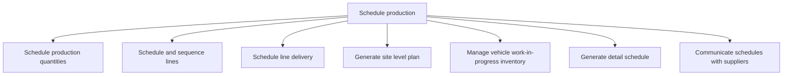

# Schedule production

> TODO: Business-as-Code definition for schedule production (automotive)

## Overview

TODO: Add process overview

## Process Hierarchy



## GraphDL

```yaml
schedule:
  object: Production
  actor: TODO
  result: TODO
```

## Actions

| Action | Description |
|--------|-------------|
| TODO | TODO |

## Events

| Event | Description |
|-------|-------------|
| TODO | TODO |

## Searches

| Search | Description |
|--------|-------------|
| TODO | TODO |

## Process Flow


## RACI Matrix

| Activity | Responsible | Accountable | Consulted | Informed |
|----------|-------------|-------------|-----------|----------|
| TODO | TODO | TODO | TODO | TODO |

## Sub-Processes

| ID | Name | Description |
|----|------|-------------|
| 4.5.1.1 | Schedule production quantities | TODO |
| 4.5.1.2 | Schedule and sequence lines | TODO |
| 4.5.1.3 | Schedule line delivery | TODO |
| 4.5.1.4 | Generate site level plan | TODO |
| 4.5.1.5 | Manage vehicle work-in-progress inventory | TODO |
| 4.5.1.6 | Generate detail schedule | TODO |
| 4.5.1.7 | Communicate schedules with suppliers | TODO |

## Related Processes

| Process | Relationship |
|---------|-------------|
| TODO | TODO |

## Related Departments

| Department | Role |
|-----------|------|
| TODO | TODO |

## Related Occupations

| Occupation | Involvement |
|-----------|-------------|
| TODO | TODO |

## KPIs

| KPI | Description | Unit |
|-----|-------------|------|
| TODO | TODO | TODO |

## Usage

```typescript
import { TODO } from '@headlessly/schedule-production'

const client = TODO()

// TODO: Example action calls
```
