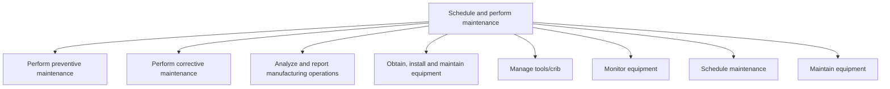

# Schedule and perform maintenance

> TODO: Business-as-Code definition for schedule and perform maintenance (automotive)

## Overview

This process addresses the activities where capital equipment and supply chain processes are maintained. For capital equipment, this means scheduling downtime, relocating production as needed to meet production demands during downtime, and coordinating all aspects of the downtime. For supply chain processes, this includes implementation of process improvement activities defined during supply chain planning activities.

## Process Hierarchy



## GraphDL

```yaml
schedule:
  object: And Perform Maintenance
  actor: TODO
  result: TODO
```

## Actions

| Action | Description |
|--------|-------------|
| TODO | TODO |

## Events

| Event | Description |
|-------|-------------|
| TODO | TODO |

## Searches

| Search | Description |
|--------|-------------|
| TODO | TODO |

## Process Flow


## RACI Matrix

| Activity | Responsible | Accountable | Consulted | Informed |
|----------|-------------|-------------|-----------|----------|
| TODO | TODO | TODO | TODO | TODO |

## Sub-Processes

| ID | Name | Description |
|----|------|-------------|
| 4.5.2.1 | Perform preventive maintenance | TODO |
| 4.5.2.2 | Perform corrective maintenance | TODO |
| 4.5.2.3 | Analyze and report manufacturing operations | TODO |
| 4.5.2.4 | Obtain, install and maintain equipment | TODO |
| 4.5.2.5 | Manage tools/crib | TODO |
| 4.5.2.6 | Monitor equipment | TODO |
| 4.5.2.7 | Schedule maintenance | TODO |
| 4.5.2.8 | Maintain equipment | TODO |

## Related Processes

| Process | Relationship |
|---------|-------------|
| TODO | TODO |

## Related Departments

| Department | Role |
|-----------|------|
| TODO | TODO |

## Related Occupations

| Occupation | Involvement |
|-----------|-------------|
| TODO | TODO |

## KPIs

| KPI | Description | Unit |
|-----|-------------|------|
| TODO | TODO | TODO |

## Usage

```typescript
import { TODO } from '@headlessly/schedule-and-perform-maintenance'

const client = TODO()

// TODO: Example action calls
```
