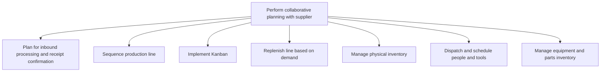

# Perform collaborative planning with supplier

> TODO: Business-as-Code definition for perform collaborative planning with supplier (automotive)

## Overview

TODO: Add process overview

## Process Hierarchy



## GraphDL

```yaml
perform:
  object: Collaborative Planning With Supplier
  actor: TODO
  result: TODO
```

## Actions

| Action | Description |
|--------|-------------|
| TODO | TODO |

## Events

| Event | Description |
|-------|-------------|
| TODO | TODO |

## Searches

| Search | Description |
|--------|-------------|
| TODO | TODO |

## Process Flow


## RACI Matrix

| Activity | Responsible | Accountable | Consulted | Informed |
|----------|-------------|-------------|-----------|----------|
| TODO | TODO | TODO | TODO | TODO |

## Sub-Processes

| ID | Name | Description |
|----|------|-------------|
| 4.5.7.1 | Plan for inbound processing and receipt confirmation | TODO |
| 4.5.7.2 | Sequence production line | TODO |
| 4.5.7.3 | Implement Kanban | TODO |
| 4.5.7.4 | Replenish line based on demand | TODO |
| 4.5.7.5 | Manage physical inventory | TODO |
| 4.5.7.6 | Dispatch and schedule people and tools | TODO |
| 4.5.7.7 | Manage equipment and parts inventory | TODO |

## Related Processes

| Process | Relationship |
|---------|-------------|
| TODO | TODO |

## Related Departments

| Department | Role |
|-----------|------|
| TODO | TODO |

## Related Occupations

| Occupation | Involvement |
|-----------|-------------|
| TODO | TODO |

## KPIs

| KPI | Description | Unit |
|-----|-------------|------|
| TODO | TODO | TODO |

## Usage

```typescript
import { TODO } from '@headlessly/perform-collaborative-planning-with-supplier'

const client = TODO()

// TODO: Example action calls
```
