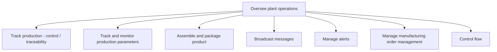

# Oversee plant operations

> TODO: Business-as-Code definition for oversee plant operations (automotive)

## Overview

TODO: Add process overview

## Process Hierarchy



## GraphDL

```yaml
oversee:
  object: Plant Operations
  actor: TODO
  result: TODO
```

## Actions

| Action | Description |
|--------|-------------|
| TODO | TODO |

## Events

| Event | Description |
|-------|-------------|
| TODO | TODO |

## Searches

| Search | Description |
|--------|-------------|
| TODO | TODO |

## Process Flow


## RACI Matrix

| Activity | Responsible | Accountable | Consulted | Informed |
|----------|-------------|-------------|-----------|----------|
| TODO | TODO | TODO | TODO | TODO |

## Sub-Processes

| ID | Name | Description |
|----|------|-------------|
| 4.5.8.1 | Track production - control / traceability | TODO |
| 4.5.8.2 | Track and monitor production parameters | TODO |
| 4.5.8.3 | Assemble and package product | TODO |
| 4.5.8.4 | Broadcast messages | TODO |
| 4.5.8.5 | Manage alerts | TODO |
| 4.5.8.6 | Manage manufacturing order management | TODO |
| 4.5.8.7 | Control flow | TODO |

## Related Processes

| Process | Relationship |
|---------|-------------|
| TODO | TODO |

## Related Departments

| Department | Role |
|-----------|------|
| TODO | TODO |

## Related Occupations

| Occupation | Involvement |
|-----------|-------------|
| TODO | TODO |

## KPIs

| KPI | Description | Unit |
|-----|-------------|------|
| TODO | TODO | TODO |

## Usage

```typescript
import { TODO } from '@headlessly/oversee-plant-operations'

const client = TODO()

// TODO: Example action calls
```
