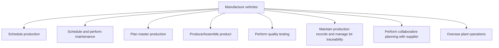

# Manufacture vehicles

> TODO: Business-as-Code definition for manufacture vehicles (automotive)

## Overview

Once a new product is designed and successfully prototyped in the processes detailed in “new vehicle development”, it can move to the production stage to be manufactured. This process group deals with physically producing the vehicles and includes processes that cover producing the product, scheduling and performing maintenance at the plant, planning and scheduling production, performing collaborative planning with suppliers who create key components and parts, and overseeing plant operations.

## Process Hierarchy



## GraphDL

```yaml
manufacture:
  object: Vehicles
  actor: TODO
  result: TODO
```

## Actions

| Action | Description |
|--------|-------------|
| TODO | TODO |

## Events

| Event | Description |
|-------|-------------|
| TODO | TODO |

## Searches

| Search | Description |
|--------|-------------|
| TODO | TODO |

## Process Flow


## RACI Matrix

| Activity | Responsible | Accountable | Consulted | Informed |
|----------|-------------|-------------|-----------|----------|
| TODO | TODO | TODO | TODO | TODO |

## Sub-Processes

| ID | Name | Description |
|----|------|-------------|
| 4.5.1 | Schedule production | TODO |
| 4.5.2 | Schedule and perform maintenance | This process addresses the activities where capital equipment and supply chain processes are maintai |
| 4.5.3 | Plan master production | TODO |
| 4.5.4 | Produce/Assemble product | Manufacturing the product. Convert the raw materials to develop consumer-ready products. Manage the  |
| 4.5.5 | Perform quality testing | Executing tests to evaluate the quality of the products manufactured. Calibrate the test equipment.  |
| 4.5.6 | Maintain production records and manage lot traceability | Perpetuating the production records by systematically documenting and using it to ensure the effecti |
| 4.5.7 | Perform collaborative planning with supplier | TODO |
| 4.5.8 | Oversee plant operations | TODO |

## Related Processes

| Process | Relationship |
|---------|-------------|
| TODO | TODO |

## Related Departments

| Department | Role |
|-----------|------|
| TODO | TODO |

## Related Occupations

| Occupation | Involvement |
|-----------|-------------|
| TODO | TODO |

## KPIs

| KPI | Description | Unit |
|-----|-------------|------|
| TODO | TODO | TODO |

## Usage

```typescript
import { TODO } from '@headlessly/manufacture-vehicles'

const client = TODO()

// TODO: Example action calls
```
