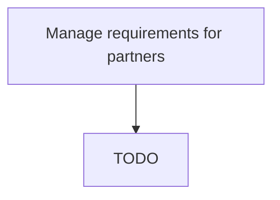

# Manage requirements for partners

> TODO: Business-as-Code definition for manage requirements for partners (automotive)

## Overview

Associating with partners to simplify and increase the efficiency of the process. Take care of the specific inventory requirements for all the partners. Ensure the timely dispatch and receiving of the inventory.

## Process Hierarchy



## GraphDL

```yaml
manage:
  object: Requirements For Partners
  actor: TODO
  result: TODO
```

## Actions

| Action | Description |
|--------|-------------|
| TODO | TODO |

## Events

| Event | Description |
|-------|-------------|
| TODO | TODO |

## Searches

| Search | Description |
|--------|-------------|
| TODO | TODO |

## Process Flow


## RACI Matrix

| Activity | Responsible | Accountable | Consulted | Informed |
|----------|-------------|-------------|-----------|----------|
| TODO | TODO | TODO | TODO | TODO |

## Related Processes

| Process | Relationship |
|---------|-------------|
| TODO | TODO |

## Related Departments

| Department | Role |
|-----------|------|
| TODO | TODO |

## Related Occupations

| Occupation | Involvement |
|-----------|-------------|
| TODO | TODO |

## KPIs

| KPI | Description | Unit |
|-----|-------------|------|
| TODO | TODO | TODO |

## Usage

```typescript
import { TODO } from '@headlessly/manage-requirements-for-partners'

const client = TODO()

// TODO: Example action calls
```
