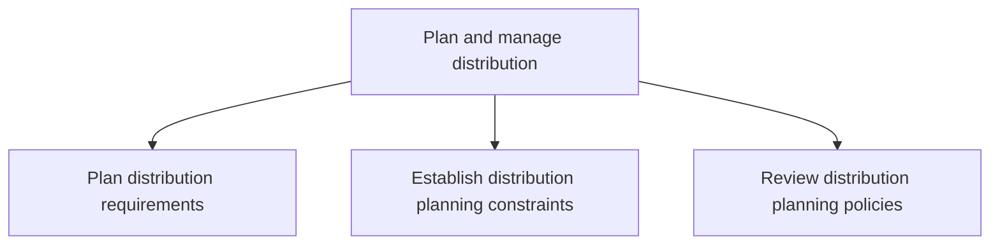

# Plan and manage distribution

> TODO: Business-as-Code definition for plan and manage distribution (automotive)

## Overview

This process group is executed upon the completion of production and addresses the allocation/distribution of stock or customer orders according to the latest view of incoming demand. This entails planning distribution requirements, establishing distribution planning constraints, reviewing distribution planning policies and assessing the performance of distribution planning. Please note that dealers and retailers distribute the vehicles to customers. Before a vehicle is distributed to customers, service technicians and advisors are trained to service the vehicle and sales assistants are given accurate and reliable product information so they can sell the vehicle and answer any questions that a customer may have. These processes are covered in “manage customer service”.

## Process Hierarchy



## GraphDL

```yaml
plan:
  object: And Manage Distribution
  actor: TODO
  result: TODO
```

## Actions

| Action | Description |
|--------|-------------|
| TODO | TODO |

## Events

| Event | Description |
|-------|-------------|
| TODO | TODO |

## Searches

| Search | Description |
|--------|-------------|
| TODO | TODO |

## Process Flow


## RACI Matrix

| Activity | Responsible | Accountable | Consulted | Informed |
|----------|-------------|-------------|-----------|----------|
| TODO | TODO | TODO | TODO | TODO |

## Sub-Processes

| ID | Name | Description |
|----|------|-------------|
| 4.7.1 | Plan distribution requirements | Maintaining master data of finished products and inventory. Identify the requirements of finished pr |
| 4.7.2 | Establish distribution planning constraints | Instituting the constraints for planning of distribution process. Create a plan that specifies every |
| 4.7.3 | Review distribution planning policies | Revisiting and refurbishing the policies for planning the distribution process. Asses the distributi |

## Related Processes

| Process | Relationship |
|---------|-------------|
| TODO | TODO |

## Related Departments

| Department | Role |
|-----------|------|
| TODO | TODO |

## Related Occupations

| Occupation | Involvement |
|-----------|-------------|
| TODO | TODO |

## KPIs

| KPI | Description | Unit |
|-----|-------------|------|
| TODO | TODO | TODO |

## Usage

```typescript
import { TODO } from '@headlessly/plan-and-manage-distribution'

const client = TODO()

// TODO: Example action calls
```
