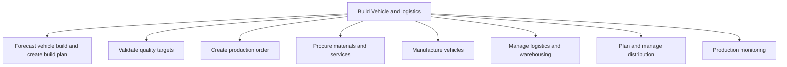

# Build Vehicle and logistics

> TODO: Business-as-Code definition for build vehicle and logistics (automotive)

## Overview

This process includes the production, inventory management, retailing and distribution processes executed in the supply chain of an OEM. It begins once the planning, design and prototyping stages of the supply chain described by the processes “new vehicle development” are complete. The first process group covers the forecasting of the vehicle build and creation of the corresponding build plan and progresses to validating quality targets, creating production orders and procuring the required materials and services. Thereafter, the vehicle is manufactured; logistics, warehousing and distribution are planned and managed; and production is monitored.

## Process Hierarchy



## GraphDL

```yaml
build:
  object: Vehicle And Logistics
  actor: TODO
  result: TODO
```

## Actions

| Action | Description |
|--------|-------------|
| TODO | TODO |

## Events

| Event | Description |
|-------|-------------|
| TODO | TODO |

## Searches

| Search | Description |
|--------|-------------|
| TODO | TODO |

## Process Flow


## RACI Matrix

| Activity | Responsible | Accountable | Consulted | Informed |
|----------|-------------|-------------|-----------|----------|
| TODO | TODO | TODO | TODO | TODO |

## Sub-Processes

| ID | Name | Description |
|----|------|-------------|
| 4.1 | Forecast vehicle build and create build plan | This process group defines the parameters needed to create a build plan and includes the capacities, |
| 4.2 | Validate quality targets | Once the build plan and parameters for production are set, the quality targets for the process valid |
| 4.3 | Create production order | This process group summarizes what is required to create a production order and addresses what happe |
| 4.4 | Procure materials and services | Creating a plan for procuring materials and services. Develop strategies for sourcing materials and  |
| 4.5 | Manufacture vehicles | Once a new product is designed and successfully prototyped in the processes detailed in “new vehicle |
| 4.6 | Manage logistics and warehousing | Administering and overseeing all activities related to logistics and warehousing. Outline and establ |
| 4.7 | Plan and manage distribution | This process group is executed upon the completion of production and addresses the allocation/distri |
| 4.8 | Production monitoring | The final supply chain process group, “production monitoring”, assesses the Master Production Schedu |

## Related Processes

| Process | Relationship |
|---------|-------------|
| TODO | TODO |

## Related Departments

| Department | Role |
|-----------|------|
| TODO | TODO |

## Related Occupations

| Occupation | Involvement |
|-----------|-------------|
| TODO | TODO |

## KPIs

| KPI | Description | Unit |
|-----|-------------|------|
| TODO | TODO | TODO |

## Usage

```typescript
import { TODO } from '@headlessly/build-vehicle-and-logistics'

const client = TODO()

// TODO: Example action calls
```
