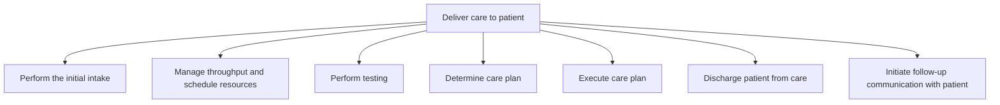

# Deliver care to patient

> TODO: Business-as-Code definition for deliver care to patient (healthcare-provider)

## Overview

TODO: Add process overview

## Process Hierarchy



## GraphDL

```yaml
deliver:
  object: Care To Patient
  actor: TODO
  result: TODO
```

## Actions

| Action | Description |
|--------|-------------|
| TODO | TODO |

## Events

| Event | Description |
|-------|-------------|
| TODO | TODO |

## Searches

| Search | Description |
|--------|-------------|
| TODO | TODO |

## Process Flow


## RACI Matrix

| Activity | Responsible | Accountable | Consulted | Informed |
|----------|-------------|-------------|-----------|----------|
| TODO | TODO | TODO | TODO | TODO |

## Sub-Processes

| ID | Name | Description |
|----|------|-------------|
| 4.8.1 | Perform the initial intake | TODO |
| 4.8.2 | Manage throughput and schedule resources | TODO |
| 4.8.3 | Perform testing | TODO |
| 4.8.4 | Determine care plan | TODO |
| 4.8.5 | Execute care plan | TODO |
| 4.8.6 | Discharge patient from care | TODO |
| 4.8.7 | Initiate follow-up communication with patient | TODO |

## Related Processes

| Process | Relationship |
|---------|-------------|
| TODO | TODO |

## Related Departments

| Department | Role |
|-----------|------|
| TODO | TODO |

## Related Occupations

| Occupation | Involvement |
|-----------|-------------|
| TODO | TODO |

## KPIs

| KPI | Description | Unit |
|-----|-------------|------|
| TODO | TODO | TODO |

## Usage

```typescript
import { TODO } from '@headlessly/deliver-care-to-patient'

const client = TODO()

// TODO: Example action calls
```
