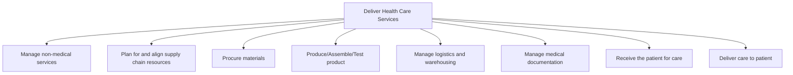

# Deliver Health Care Services

> TODO: Business-as-Code definition for deliver health care services (healthcare-provider)

## Overview

TODO: Add process overview

## Process Hierarchy



## GraphDL

```yaml
deliver:
  object: Health Care Services
  actor: TODO
  result: TODO
```

## Actions

| Action | Description |
|--------|-------------|
| TODO | TODO |

## Events

| Event | Description |
|-------|-------------|
| TODO | TODO |

## Searches

| Search | Description |
|--------|-------------|
| TODO | TODO |

## Process Flow


## RACI Matrix

| Activity | Responsible | Accountable | Consulted | Informed |
|----------|-------------|-------------|-----------|----------|
| TODO | TODO | TODO | TODO | TODO |

## Sub-Processes

| ID | Name | Description |
|----|------|-------------|
| 4.1 | Manage non-medical services | TODO |
| 4.2 | Plan for and align supply chain resources | TODO |
| 4.3 | Procure materials | TODO |
| 4.4 | Produce/Assemble/Test product | TODO |
| 4.5 | Manage logistics and warehousing | TODO |
| 4.6 | Manage medical documentation | TODO |
| 4.7 | Receive the patient for care | TODO |
| 4.8 | Deliver care to patient | TODO |

## Related Processes

| Process | Relationship |
|---------|-------------|
| TODO | TODO |

## Related Departments

| Department | Role |
|-----------|------|
| TODO | TODO |

## Related Occupations

| Occupation | Involvement |
|-----------|-------------|
| TODO | TODO |

## KPIs

| KPI | Description | Unit |
|-----|-------------|------|
| TODO | TODO | TODO |

## Usage

```typescript
import { TODO } from '@headlessly/deliver-health-care-services'

const client = TODO()

// TODO: Example action calls
```
