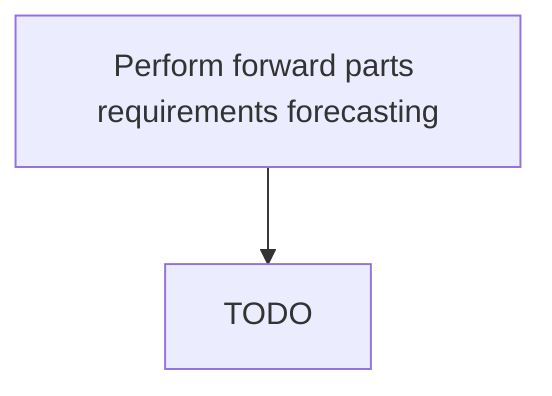

# Perform forward parts requirements forecasting

> TODO: Business-as-Code definition for perform forward parts requirements forecasting (aerospace-and-defense)

## Overview

Analyzing historical needs to forecast future requirements. This capability requires taking a snapshot of the requirements in the past, comparing the requirements under the circumstances under which those requirements were generated, using a combination of both quantitative methods and subjective analysis to extrapolate requirements for parts based on a customer's future requirement projections.  Some examples of current conditions may include fleet growth, current schedules that are in operation that help define part needs, etc.

## Process Hierarchy



## GraphDL

```yaml
perform:
  object: Forward Parts Requirements Forecasting
  actor: TODO
  result: TODO
```

## Actions

| Action | Description |
|--------|-------------|
| TODO | TODO |

## Events

| Event | Description |
|-------|-------------|
| TODO | TODO |

## Searches

| Search | Description |
|--------|-------------|
| TODO | TODO |

## Process Flow


## RACI Matrix

| Activity | Responsible | Accountable | Consulted | Informed |
|----------|-------------|-------------|-----------|----------|
| TODO | TODO | TODO | TODO | TODO |

## Related Processes

| Process | Relationship |
|---------|-------------|
| TODO | TODO |

## Related Departments

| Department | Role |
|-----------|------|
| TODO | TODO |

## Related Occupations

| Occupation | Involvement |
|-----------|-------------|
| TODO | TODO |

## KPIs

| KPI | Description | Unit |
|-----|-------------|------|
| TODO | TODO | TODO |

## Usage

```typescript
import { TODO } from '@headlessly/perform-forward-parts-requirements-forecasting'

const client = TODO()

// TODO: Example action calls
```
