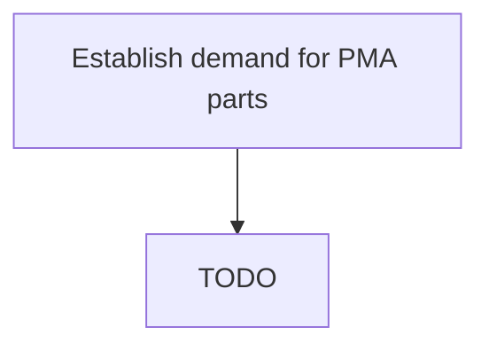

# Establish demand for PMA parts

> TODO: Business-as-Code definition for establish demand for pma parts (aerospace-and-defense)

## Overview

Establishing PMA parts demand with customers use.  PMA parts is governed by many factors such as aircraft type, who owns the aircraft: airline / leasing company, etc..  PMA parts management is the discipline  by which you define, understand and manage the process of PMA parts. It requires knowing the demand for PMA parts, using that to figure out how much to carry and at what locations.  It is a commercial contractual decision whether or not a customer will use PMA parts.   Some customers will be prepared to buy PMA parts as they are cheaper.  (This is also dependent upon the type of aircraft they are flying or whether the regulatory authority in a specific country allows the use of PMA parts).  This must be considered when doing demand planning. Parts Manufacturer Approval (PMA) is an approval granted by the United States Federal Aviation Administration (FAA) to a manufacturer of aircraft parts.  It is generally illegal in the United States to install replacement or modification parts on a certificated aircraft without a PMA (although there are a number of exceptions to this general rule, including parts manufactured to government or industry standards, parts manufactured under technical standard order authorization [TSOA], experimental aircraft, etc.). Thus, PMA-holding manufacturers are permitted to make replacement parts for aircraft, even though they may not have been the original manufacturer of the aircraft.  An applicant for a PMA applies for approval from the FAA. The FAA prioritizes its review of a new application based on its internal process called Project Prioritization.

## Process Hierarchy



## GraphDL

```yaml
establish:
  object: Demand For PMA Parts
  actor: TODO
  result: TODO
```

## Actions

| Action | Description |
|--------|-------------|
| TODO | TODO |

## Events

| Event | Description |
|-------|-------------|
| TODO | TODO |

## Searches

| Search | Description |
|--------|-------------|
| TODO | TODO |

## Process Flow


## RACI Matrix

| Activity | Responsible | Accountable | Consulted | Informed |
|----------|-------------|-------------|-----------|----------|
| TODO | TODO | TODO | TODO | TODO |

## Related Processes

| Process | Relationship |
|---------|-------------|
| TODO | TODO |

## Related Departments

| Department | Role |
|-----------|------|
| TODO | TODO |

## Related Occupations

| Occupation | Involvement |
|-----------|-------------|
| TODO | TODO |

## KPIs

| KPI | Description | Unit |
|-----|-------------|------|
| TODO | TODO | TODO |

## Usage

```typescript
import { TODO } from '@headlessly/establish-demand-for-pma-parts'

const client = TODO()

// TODO: Example action calls
```
