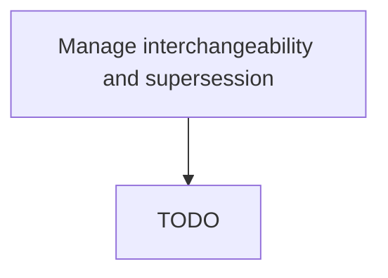

# Manage interchangeability and supersession

> TODO: Business-as-Code definition for manage interchangeability and supersession (aerospace-and-defense)

## Overview

Determining continued parts purchasing.  Supersession is a commercial decision. From a commercial perspective, a company takes a strategic decision that it will no longer buy a part that is fully interchangeable, e.g.. For pricing reasons, for quality reasons etc. Rather than dealing with Parts A,B,C,D that are fully interchangeable, it will only now deal with Parts C and D. A is too expensive, B is too low quality.

## Process Hierarchy



## GraphDL

```yaml
manage:
  object: Interchangeability And Supersession
  actor: TODO
  result: TODO
```

## Actions

| Action | Description |
|--------|-------------|
| TODO | TODO |

## Events

| Event | Description |
|-------|-------------|
| TODO | TODO |

## Searches

| Search | Description |
|--------|-------------|
| TODO | TODO |

## Process Flow


## RACI Matrix

| Activity | Responsible | Accountable | Consulted | Informed |
|----------|-------------|-------------|-----------|----------|
| TODO | TODO | TODO | TODO | TODO |

## Related Processes

| Process | Relationship |
|---------|-------------|
| TODO | TODO |

## Related Departments

| Department | Role |
|-----------|------|
| TODO | TODO |

## Related Occupations

| Occupation | Involvement |
|-----------|-------------|
| TODO | TODO |

## KPIs

| KPI | Description | Unit |
|-----|-------------|------|
| TODO | TODO | TODO |

## Usage

```typescript
import { TODO } from '@headlessly/manage-interchangeability-and-supersession'

const client = TODO()

// TODO: Example action calls
```
