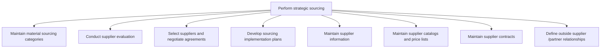

# Perform strategic sourcing

> TODO: Business-as-Code definition for perform strategic sourcing (aerospace-and-defense)

## Overview

Improving and evaluating purchasing activities.  In a production environment, strategic sourcing is often considered one component of supply chain management. Strategic sourcing techniques are also applied to nontraditional areas such as services or capital and has become the norm for procurement departments in large, sophisticated companies.

## Process Hierarchy



## GraphDL

```yaml
perform:
  object: Strategic Sourcing
  actor: TODO
  result: TODO
```

## Actions

| Action | Description |
|--------|-------------|
| TODO | TODO |

## Events

| Event | Description |
|-------|-------------|
| TODO | TODO |

## Searches

| Search | Description |
|--------|-------------|
| TODO | TODO |

## Process Flow


## RACI Matrix

| Activity | Responsible | Accountable | Consulted | Informed |
|----------|-------------|-------------|-----------|----------|
| TODO | TODO | TODO | TODO | TODO |

## Sub-Processes

| ID | Name | Description |
|----|------|-------------|
| 4.2.4.1 | Maintain material sourcing categories | TODO |
| 4.2.4.2 | Conduct supplier evaluation | TODO |
| 4.2.4.3 | Select suppliers and negotiate agreements | TODO |
| 4.2.4.4 | Develop sourcing implementation plans | TODO |
| 4.2.4.5 | Maintain supplier information | TODO |
| 4.2.4.6 | Maintain supplier catalogs and price lists | TODO |
| 4.2.4.7 | Maintain supplier contracts | TODO |
| 4.2.4.8 | Define outside supplier /partner relationships | TODO |

## Related Processes

| Process | Relationship |
|---------|-------------|
| TODO | TODO |

## Related Departments

| Department | Role |
|-----------|------|
| TODO | TODO |

## Related Occupations

| Occupation | Involvement |
|-----------|-------------|
| TODO | TODO |

## KPIs

| KPI | Description | Unit |
|-----|-------------|------|
| TODO | TODO | TODO |

## Usage

```typescript
import { TODO } from '@headlessly/perform-strategic-sourcing'

const client = TODO()

// TODO: Example action calls
```
