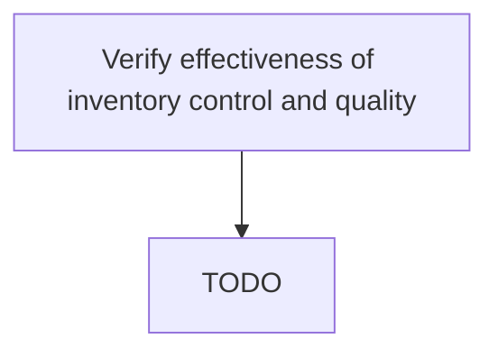

# Verify effectiveness of inventory control and quality

> TODO: Business-as-Code definition for verify effectiveness of inventory control and quality (aerospace-and-defense)

## Overview

Analyzing issues related to quality as perceived by customers. Follow parts trends to identify issues with FIFO consumption of parts, the delivery of documented parts, defective or non-working parts, and the compliancy of parts that are configured for the aircraft.

## Process Hierarchy



## GraphDL

```yaml
verify:
  object: Effectiveness Of Inventory Control And Quality
  actor: TODO
  result: TODO
```

## Actions

| Action | Description |
|--------|-------------|
| TODO | TODO |

## Events

| Event | Description |
|-------|-------------|
| TODO | TODO |

## Searches

| Search | Description |
|--------|-------------|
| TODO | TODO |

## Process Flow


## RACI Matrix

| Activity | Responsible | Accountable | Consulted | Informed |
|----------|-------------|-------------|-----------|----------|
| TODO | TODO | TODO | TODO | TODO |

## Related Processes

| Process | Relationship |
|---------|-------------|
| TODO | TODO |

## Related Departments

| Department | Role |
|-----------|------|
| TODO | TODO |

## Related Occupations

| Occupation | Involvement |
|-----------|-------------|
| TODO | TODO |

## KPIs

| KPI | Description | Unit |
|-----|-------------|------|
| TODO | TODO | TODO |

## Usage

```typescript
import { TODO } from '@headlessly/verify-effectiveness-of-inventory-control-and-quality'

const client = TODO()

// TODO: Example action calls
```
