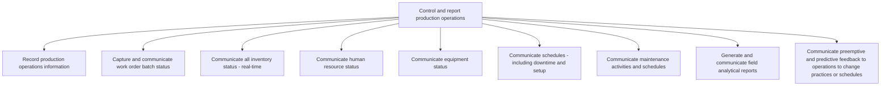

# Control and report production operations

> TODO: Business-as-Code definition for control and report production operations (aerospace-and-defense)

## Overview

TODO: Add process overview

## Process Hierarchy



## GraphDL

```yaml
control:
  object: And Report Production Operations
  actor: TODO
  result: TODO
```

## Actions

| Action | Description |
|--------|-------------|
| TODO | TODO |

## Events

| Event | Description |
|-------|-------------|
| TODO | TODO |

## Searches

| Search | Description |
|--------|-------------|
| TODO | TODO |

## Process Flow


## RACI Matrix

| Activity | Responsible | Accountable | Consulted | Informed |
|----------|-------------|-------------|-----------|----------|
| TODO | TODO | TODO | TODO | TODO |

## Sub-Processes

| ID | Name | Description |
|----|------|-------------|
| 4.3.13.1 | Record production operations information | TODO |
| 4.3.13.2 | Capture and communicate work order batch status | TODO |
| 4.3.13.3 | Communicate all inventory status - real-time | TODO |
| 4.3.13.4 | Communicate human resource status | TODO |
| 4.3.13.5 | Communicate equipment status | TODO |
| 4.3.13.6 | Communicate schedules - including downtime and setup | TODO |
| 4.3.13.7 | Communicate maintenance activities and schedules | TODO |
| 4.3.13.8 | Generate and communicate field analytical reports | TODO |
| 4.3.13.9 | Communicate preemptive and predictive feedback to operations to change practices or schedules | TODO |

## Related Processes

| Process | Relationship |
|---------|-------------|
| TODO | TODO |

## Related Departments

| Department | Role |
|-----------|------|
| TODO | TODO |

## Related Occupations

| Occupation | Involvement |
|-----------|-------------|
| TODO | TODO |

## KPIs

| KPI | Description | Unit |
|-----|-------------|------|
| TODO | TODO | TODO |

## Usage

```typescript
import { TODO } from '@headlessly/control-and-report-production-operations'

const client = TODO()

// TODO: Example action calls
```
