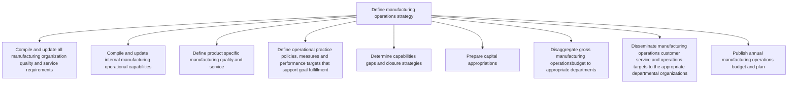

# Define manufacturing operations strategy

> TODO: Business-as-Code definition for define manufacturing operations strategy (aerospace-and-defense)

## Overview

TODO: Add process overview

## Process Hierarchy



## GraphDL

```yaml
define:
  object: Manufacturing Operations Strategy
  actor: TODO
  result: TODO
```

## Actions

| Action | Description |
|--------|-------------|
| TODO | TODO |

## Events

| Event | Description |
|-------|-------------|
| TODO | TODO |

## Searches

| Search | Description |
|--------|-------------|
| TODO | TODO |

## Process Flow


## RACI Matrix

| Activity | Responsible | Accountable | Consulted | Informed |
|----------|-------------|-------------|-----------|----------|
| TODO | TODO | TODO | TODO | TODO |

## Sub-Processes

| ID | Name | Description |
|----|------|-------------|
| 4.3.2.1 | Compile and update all manufacturing organization quality and service requirements | TODO |
| 4.3.2.2 | Compile and update internal manufacturing operational capabilities | TODO |
| 4.3.2.3 | Define product specific manufacturing quality and service | TODO |
| 4.3.2.4 | Define operational practice policies, measures and performance targets that support goal fulfillment | TODO |
| 4.3.2.5 | Determine capabilities gaps and closure strategies | TODO |
| 4.3.2.6 | Prepare capital appropriations | TODO |
| 4.3.2.7 | Disaggregate gross manufacturing operationsbudget to appropriate departments | TODO |
| 4.3.2.8 | Disseminate manufacturing operations customer service and operations targets to the appropriate departmental organizations | TODO |
| 4.3.2.9 | Publish annual manufacturing operations budget and plan | TODO |

## Related Processes

| Process | Relationship |
|---------|-------------|
| TODO | TODO |

## Related Departments

| Department | Role |
|-----------|------|
| TODO | TODO |

## Related Occupations

| Occupation | Involvement |
|-----------|-------------|
| TODO | TODO |

## KPIs

| KPI | Description | Unit |
|-----|-------------|------|
| TODO | TODO | TODO |

## Usage

```typescript
import { TODO } from '@headlessly/define-manufacturing-operations-strategy'

const client = TODO()

// TODO: Example action calls
```
