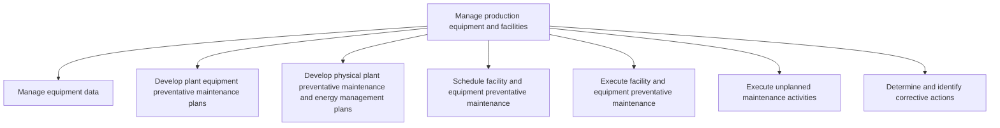

# Manage production equipment and facilities

> TODO: Business-as-Code definition for manage production equipment and facilities (aerospace-and-defense)

## Overview

TODO: Add process overview

## Process Hierarchy



## GraphDL

```yaml
manage:
  object: Production Equipment And Facilities
  actor: TODO
  result: TODO
```

## Actions

| Action | Description |
|--------|-------------|
| TODO | TODO |

## Events

| Event | Description |
|-------|-------------|
| TODO | TODO |

## Searches

| Search | Description |
|--------|-------------|
| TODO | TODO |

## Process Flow


## RACI Matrix

| Activity | Responsible | Accountable | Consulted | Informed |
|----------|-------------|-------------|-----------|----------|
| TODO | TODO | TODO | TODO | TODO |

## Sub-Processes

| ID | Name | Description |
|----|------|-------------|
| 4.3.4.1 | Manage equipment data | TODO |
| 4.3.4.2 | Develop plant equipment preventative maintenance plans | TODO |
| 4.3.4.3 | Develop physical plant preventative maintenance and energy management plans | TODO |
| 4.3.4.4 | Schedule facility and equipment preventative maintenance | TODO |
| 4.3.4.5 | Execute facility and equipment preventative maintenance | TODO |
| 4.3.4.6 | Execute unplanned maintenance activities | TODO |
| 4.3.4.7 | Determine and identify corrective actions | TODO |

## Related Processes

| Process | Relationship |
|---------|-------------|
| TODO | TODO |

## Related Departments

| Department | Role |
|-----------|------|
| TODO | TODO |

## Related Occupations

| Occupation | Involvement |
|-----------|-------------|
| TODO | TODO |

## KPIs

| KPI | Description | Unit |
|-----|-------------|------|
| TODO | TODO | TODO |

## Usage

```typescript
import { TODO } from '@headlessly/manage-production-equipment-and-facilities'

const client = TODO()

// TODO: Example action calls
```
