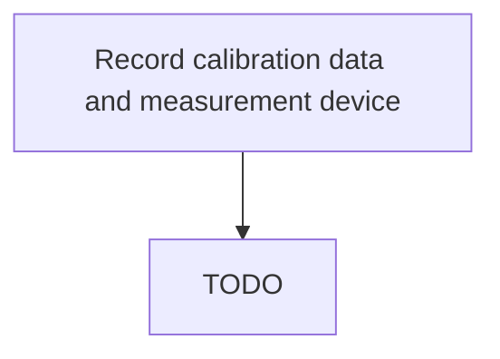

# Record calibration data and measurement device

> TODO: Business-as-Code definition for record calibration data and measurement device (aerospace-and-defense)

## Overview

Tracking tool calibration.  Record and track when the tool was last calibrated and if it is still safe to use and still within the defined tolerances.  Apply for the production certification, which when granted, means that the Regulator has looked at production procedures and are satisfied.

## Process Hierarchy



## GraphDL

```yaml
record:
  object: Calibration Data And Measurement Device
  actor: TODO
  result: TODO
```

## Actions

| Action | Description |
|--------|-------------|
| TODO | TODO |

## Events

| Event | Description |
|-------|-------------|
| TODO | TODO |

## Searches

| Search | Description |
|--------|-------------|
| TODO | TODO |

## Process Flow


## RACI Matrix

| Activity | Responsible | Accountable | Consulted | Informed |
|----------|-------------|-------------|-----------|----------|
| TODO | TODO | TODO | TODO | TODO |

## Related Processes

| Process | Relationship |
|---------|-------------|
| TODO | TODO |

## Related Departments

| Department | Role |
|-----------|------|
| TODO | TODO |

## Related Occupations

| Occupation | Involvement |
|-----------|-------------|
| TODO | TODO |

## KPIs

| KPI | Description | Unit |
|-----|-------------|------|
| TODO | TODO | TODO |

## Usage

```typescript
import { TODO } from '@headlessly/record-calibration-data-and-measurement-device'

const client = TODO()

// TODO: Example action calls
```
