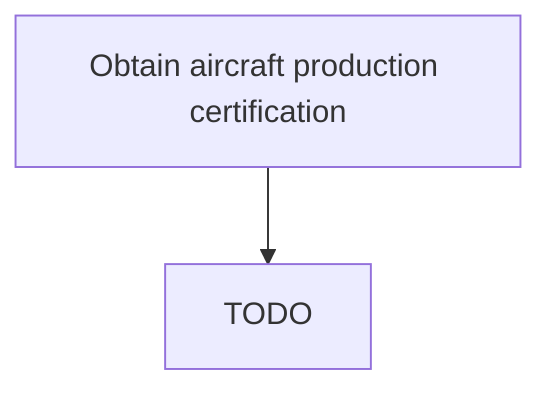

# Obtain aircraft production certification

> TODO: Business-as-Code definition for obtain aircraft production certification (aerospace-and-defense)

## Overview

Verifying aircraft production compliance for certification acquisition. Certification is obtained when a new product is produced and one last quality check has been performed before mass production.  Once Record calibration data and measurement device [12035] is complete and the first aircraft / product has actually been built, the Regulator has to verify that what is produced matches the approved design and that the processes in place are sufficiently robust for the aircraft to be produced as designed.  This means that the regulator does not have to certify every aircraft that rolls off the production line - every plane that rolls off will be produced in the same way and to the same standard as the one before.

## Process Hierarchy



## GraphDL

```yaml
obtain:
  object: Aircraft Production Certification
  actor: TODO
  result: TODO
```

## Actions

| Action | Description |
|--------|-------------|
| TODO | TODO |

## Events

| Event | Description |
|-------|-------------|
| TODO | TODO |

## Searches

| Search | Description |
|--------|-------------|
| TODO | TODO |

## Process Flow


## RACI Matrix

| Activity | Responsible | Accountable | Consulted | Informed |
|----------|-------------|-------------|-----------|----------|
| TODO | TODO | TODO | TODO | TODO |

## Related Processes

| Process | Relationship |
|---------|-------------|
| TODO | TODO |

## Related Departments

| Department | Role |
|-----------|------|
| TODO | TODO |

## Related Occupations

| Occupation | Involvement |
|-----------|-------------|
| TODO | TODO |

## KPIs

| KPI | Description | Unit |
|-----|-------------|------|
| TODO | TODO | TODO |

## Usage

```typescript
import { TODO } from '@headlessly/obtain-aircraft-production-certification'

const client = TODO()

// TODO: Example action calls
```
