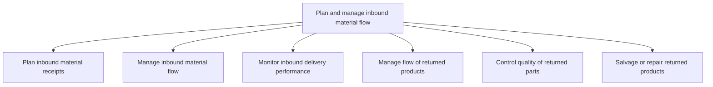

# Plan and manage inbound material flow

> TODO: Business-as-Code definition for plan and manage inbound material flow (aerospace-and-defense)

## Overview

Working out the receipts of the inbound materials. Supervise the inbound delivery processes. Judge its efficiency. Take care of the deviations such as defective and incorrectly delivered products/materials.

## Process Hierarchy



## GraphDL

```yaml
plan:
  object: And Manage Inbound Material Flow
  actor: TODO
  result: TODO
```

## Actions

| Action | Description |
|--------|-------------|
| TODO | TODO |

## Events

| Event | Description |
|-------|-------------|
| TODO | TODO |

## Searches

| Search | Description |
|--------|-------------|
| TODO | TODO |

## Process Flow


## RACI Matrix

| Activity | Responsible | Accountable | Consulted | Informed |
|----------|-------------|-------------|-----------|----------|
| TODO | TODO | TODO | TODO | TODO |

## Sub-Processes

| ID | Name | Description |
|----|------|-------------|
| 4.4.2.1 | Plan inbound material receipts | Managing the receipts of inbound materials. Create a plan accounting for the materials procured from |
| 4.4.2.2 | Manage inbound material flow | Managing all the internal activities related to the flow/transfer of materials. Manage materials bei |
| 4.4.2.3 | Monitor inbound delivery performance | Overseeing the performance of an inbound delivery system. Check the present delivery system's effici |
| 4.4.2.4 | Manage flow of returned products | Tracking and taking care of the products that have been internally returned either because of their  |
| 4.4.2.5 | Control quality of returned parts | Implement a checks and balances system to verify that returned parts meet acceptable quality standar |
| 4.4.2.6 | Salvage or repair returned products | Determining if a returned product can be salvaged or repaired. Salvage or repair is dependent upon t |

## Related Processes

| Process | Relationship |
|---------|-------------|
| TODO | TODO |

## Related Departments

| Department | Role |
|-----------|------|
| TODO | TODO |

## Related Occupations

| Occupation | Involvement |
|-----------|-------------|
| TODO | TODO |

## KPIs

| KPI | Description | Unit |
|-----|-------------|------|
| TODO | TODO | TODO |

## Usage

```typescript
import { TODO } from '@headlessly/plan-and-manage-inbound-material-flow'

const client = TODO()

// TODO: Example action calls
```
