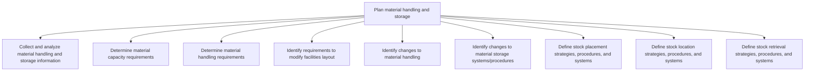

# Plan material handling and storage

> TODO: Business-as-Code definition for plan material handling and storage (aerospace-and-defense)

## Overview

TODO: Add process overview

## Process Hierarchy



## GraphDL

```yaml
plan:
  object: Material Handling And Storage
  actor: TODO
  result: TODO
```

## Actions

| Action | Description |
|--------|-------------|
| TODO | TODO |

## Events

| Event | Description |
|-------|-------------|
| TODO | TODO |

## Searches

| Search | Description |
|--------|-------------|
| TODO | TODO |

## Process Flow


## RACI Matrix

| Activity | Responsible | Accountable | Consulted | Informed |
|----------|-------------|-------------|-----------|----------|
| TODO | TODO | TODO | TODO | TODO |

## Sub-Processes

| ID | Name | Description |
|----|------|-------------|
| 4.4.6.1 | Collect and analyze material handling and storage information | TODO |
| 4.4.6.2 | Determine material capacity requirements | TODO |
| 4.4.6.3 | Determine material handling requirements | TODO |
| 4.4.6.4 | Identify requirements to modify facilities layout | TODO |
| 4.4.6.5 | Identify changes to material handling | TODO |
| 4.4.6.6 | Identify changes to material storage systems/procedures | TODO |
| 4.4.6.7 | Define stock placement strategies, procedures, and systems | TODO |
| 4.4.6.8 | Define stock location strategies, procedures, and systems | TODO |
| 4.4.6.9 | Define stock retrieval strategies, procedures, and systems | TODO |

## Related Processes

| Process | Relationship |
|---------|-------------|
| TODO | TODO |

## Related Departments

| Department | Role |
|-----------|------|
| TODO | TODO |

## Related Occupations

| Occupation | Involvement |
|-----------|-------------|
| TODO | TODO |

## KPIs

| KPI | Description | Unit |
|-----|-------------|------|
| TODO | TODO | TODO |

## Usage

```typescript
import { TODO } from '@headlessly/plan-material-handling-and-storage'

const client = TODO()

// TODO: Example action calls
```
