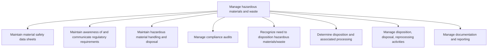

# Manage hazardous materials and waste

> TODO: Business-as-Code definition for manage hazardous materials and waste (aerospace-and-defense)

## Overview

TODO: Add process overview

## Process Hierarchy



## GraphDL

```yaml
manage:
  object: Hazardous Materials And Waste
  actor: TODO
  result: TODO
```

## Actions

| Action | Description |
|--------|-------------|
| TODO | TODO |

## Events

| Event | Description |
|-------|-------------|
| TODO | TODO |

## Searches

| Search | Description |
|--------|-------------|
| TODO | TODO |

## Process Flow


## RACI Matrix

| Activity | Responsible | Accountable | Consulted | Informed |
|----------|-------------|-------------|-----------|----------|
| TODO | TODO | TODO | TODO | TODO |

## Sub-Processes

| ID | Name | Description |
|----|------|-------------|
| 4.4.8.1 | Maintain material safety data sheets | Preparing material safety sheets. Capture material safety records to properly apply handling and dis |
| 4.4.8.2 | Maintain awareness of and communicate regulatory requirements | Understanding and communicating hazardous material regulatory requirements. |
| 4.4.8.3 | Maintain hazardous material handling and disposal | Planning, overseeing, and tracking hazardous material handling and disposal. |
| 4.4.8.4 | Manage compliance audits | Planning, supporting, and documenting hazardous material audits. |
| 4.4.8.5 | Recognize need to disposition hazardous materials/waste | Identifying and establishing approaches to dispose of hazardous materials/waste. |
| 4.4.8.6 | Determine disposition and associated processing | Evaluating hazardous materials and waste for appropriate disposition. Apply requirements and initiat |
| 4.4.8.7 | Manage disposition, disposal, reprocessing activities | Performing disposition, disposal, and reprocessing activities. |
| 4.4.8.8 | Manage documentation and reporting | Documenting and reporting disposition, disposal, and reprocessing activities. |

## Related Processes

| Process | Relationship |
|---------|-------------|
| TODO | TODO |

## Related Departments

| Department | Role |
|-----------|------|
| TODO | TODO |

## Related Occupations

| Occupation | Involvement |
|-----------|-------------|
| TODO | TODO |

## KPIs

| KPI | Description | Unit |
|-----|-------------|------|
| TODO | TODO | TODO |

## Usage

```typescript
import { TODO } from '@headlessly/manage-hazardous-materials-and-waste'

const client = TODO()

// TODO: Example action calls
```
