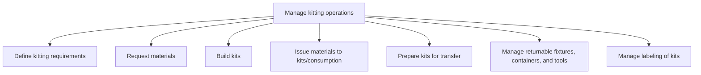

# Manage kitting operations

> TODO: Business-as-Code definition for manage kitting operations (aerospace-and-defense)

## Overview

TODO: Add process overview

## Process Hierarchy



## GraphDL

```yaml
manage:
  object: Kitting Operations
  actor: TODO
  result: TODO
```

## Actions

| Action | Description |
|--------|-------------|
| TODO | TODO |

## Events

| Event | Description |
|-------|-------------|
| TODO | TODO |

## Searches

| Search | Description |
|--------|-------------|
| TODO | TODO |

## Process Flow


## RACI Matrix

| Activity | Responsible | Accountable | Consulted | Informed |
|----------|-------------|-------------|-----------|----------|
| TODO | TODO | TODO | TODO | TODO |

## Sub-Processes

| ID | Name | Description |
|----|------|-------------|
| 4.4.9.1 | Define kitting requirements | TODO |
| 4.4.9.2 | Request materials | TODO |
| 4.4.9.3 | Build kits | TODO |
| 4.4.9.4 | Issue materials to kits/consumption | TODO |
| 4.4.9.5 | Prepare kits for transfer | TODO |
| 4.4.9.6 | Manage returnable fixtures, containers, and tools | TODO |
| 4.4.9.7 | Manage labeling of kits | TODO |

## Related Processes

| Process | Relationship |
|---------|-------------|
| TODO | TODO |

## Related Departments

| Department | Role |
|-----------|------|
| TODO | TODO |

## Related Occupations

| Occupation | Involvement |
|-----------|-------------|
| TODO | TODO |

## KPIs

| KPI | Description | Unit |
|-----|-------------|------|
| TODO | TODO | TODO |

## Usage

```typescript
import { TODO } from '@headlessly/manage-kitting-operations'

const client = TODO()

// TODO: Example action calls
```
